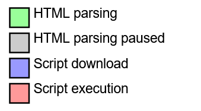
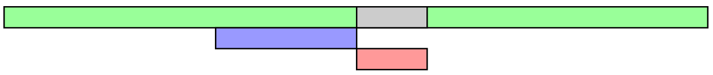

# DOMContentLoaded事件

### 概念

在MDN中，DOMContentLoaded是这样被解释的：

当初始的 HTML 文档被完全加载和解析完成之后，DOMContentLoaded 事件被触发，而无需等待样式表、图像和子框架的完全加载。

要理解“HTML文档被完全加载和解析”，需要知道浏览器的 渲染引擎 是如何工作的。

##### 渲染引擎
渲染引擎也叫呈现引擎、浏览器内核，顾名思义它的任务就是把请求来的HTML解析、渲染成我们现在看到的网页。

可以概括成如下四个步骤： 

- 将HTML文档各标记逐个转化成DOM树上的节点
- 如果有CSS，解析CSS生成CSSOM树。将DOM与CSSOM结合生成渲染树
- 为每个节点分配在屏幕中的确切坐标和大小，即布局阶段
- 绘制阶段，遍历渲染树，由用户界面后端将每个节点绘制出来

如果在解析HTML过程中遇到JS代码又会怎样呢？

##### JavaScript引擎
JavaScript引擎又称JavaScript解析器，用于解析和执行JavaScript代码。需要注意的是，渲染引擎和JS引擎是互斥关系，在JS引擎工作的时候渲染会被挂起等待。

因此，渲染引擎遇到JS代码时，会先停止对HTML的解析，等JS引擎解析和执行完JS代码，渲染引擎继续工作。这也是为什么把<script>元素放<body>元素中最后的原因。

回到一开始的问题，“HTML文档被完全加载和解析”是指什么。文档完全加载和解析即渲染的第一个阶段：DOM树构建完成。

DOMContentLoaded在DOM树构建完成后立即触发，而不用等CSS文件、JS文件等其他资源加载完成。

上面所说的是同步脚本的情况，如果是异步脚本，DOMContentLoaded情况又有些许不同。

### 异步脚本 与 DOMContentLoaded
异步脚本可以在不影响页面解析的情况下加载脚本（注意不包括脚本执行，脚本执行时文档仍然停止解析）。
在script标签中添加defer、async属性，即把脚本变为了异步脚本。
- defer属性 
告诉浏览器立即开始加载脚本，加载脚本时不影响文档解析，但应该推迟执行，即等文档解析完再执行
- async属性 
与defer类似，但是脚本加载完后脚本就执行了

下面几个图可以很容易分清同步、defer、async： 
[图片来源请戳这里](https://www.growingwiththeweb.com/2014/02/async-vs-defer-attributes.html)

同步： 

defer:  

async:  

对于defer，文档构建不受影响，文档解析完毕再执行脚本。DOMContentLoaded事件会在脚本执行后再触发；
对于async，浏览器不必等脚本下载和执行完再加载文档，只要文档加载、解析完毕，DOMContentLoaded事件则触发

### DOMContentLoaded 与 load
两者的区别在于，DOMContentLoaded在HTML文档加载、解析完全后触发；load事件会在整个页面（包括CSS文件、JS文件、图片等资源）完全加载后才触发。
