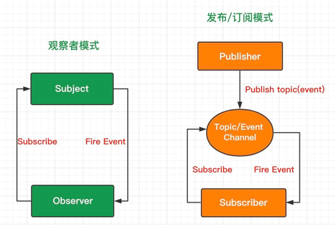

# JS设计模式

参考：
- [JS设计模式有哪些？有什么区别？](https://zhuanlan.zhihu.com/p/142304509)
- [深入理解JavaScript系列](https://www.cnblogs.com/TomXu/archive/2011/12/15/2288411.html)
- [掘金小册 - JavaScript 设计模式核⼼原理与应⽤实践](https://www.weisuoke.com/fe2020/Gof/juejin-GoF.html)
- [JavaScript设计模式es6（23种)](https://juejin.cn/post/6844904032826294286)
- [JavaScript设计模式与实践--工厂模式](https://juejin.cn/post/6844903653774458888)
- [写给前端的设计模式](https://www.yuque.com/wubinhp/uxiv5i)
- [从ES6重新认识JavaScript设计模式(三): 建造者模式](https://www.jianshu.com/p/be61fcc47a2f)
- [javascript设计模式-生成器模式（Builder）](https://www.cnblogs.com/webFrontDev/p/3471983.html)
- [JavaScript如何实现建造者模式？](https://www.cnblogs.com/yangxianyang/p/13675551.html)
- [JS设计模式七：装饰者模式](http://blog.chinaunix.net/uid-26672038-id-4364155.html)
- [关于享元模式](https://blog.csdn.net/weixin_36094484/article/details/80517145)
- [设计模式指观察者模式](https://juejin.cn/post/6844903698154389517#heading-0)
- [观察者模式与订阅发布模式的区别](https://www.cnblogs.com/onepixel/p/10806891.html)


## 1.设计原则
##### 单一职责原则（SRP）
一个对象或方法只做一件事情。如果一个方法承担了过多的职责，那么在需求的变迁过程中，需要改写这个方法的可能性就越大。应该把对象或方法划分成较小的粒度

##### 最少知识原则（LKP）
应当尽量减少对象之间的交互，如果两个对象之间不必彼此直接通信，那么这两个对象就不要发生直接的联系，可以转交给第三方进行处理

##### 开放-封闭原则（OCP）
类、模块、函数等应该是可以扩展的，但是不可修改。当需要改变一个程序的功能或者给这个程序增加新功能的时候，可以使用增加代码的方式，尽量避免改动程序的源代码，防止影响原系统的稳定

## 2.设计模式分类
##### 创建型设计模式
关注对象的创建方式，减少对象创建过程的复杂性。常见的创建型设计模式：
- 工厂模式
- 抽象工厂模式
- 构造函数模式
- 原型模式
- 单例模式
- 生成器模式（建造者模式）

##### 结构设计模式
关注增强对象功能、对象组成结构、不同对象之间的关系。有助于在系统某一部分发生改变时，不需要改变整个结构。
- 装饰者模式
- 外观模式
- 享元模式
- 适配器模式
- 代理模式

#### 行为设计模式
行为设计模式关注改善或精简在系统中不同对象间通信。
- 迭代器模式
- 中介者模式
- 观察者模式
- 访问者模式
- 发布-订阅模式
- 职责链模式
- 策略模式

## 3.工厂模式与抽象工厂模式
### 3.1工厂模式
工厂模式定义一个创建对象的通用接口，让实现这个接口的类来决定实例化哪个类，主要用来创建同一类对象。
比如根据用户的不同权限渲染展示不同的页面：
```javascript
    //简单工厂模式
    let UserFactory = function (role) {
      function SuperAdmin(){
        this.role = "超级管理员",
        this.view = ["首页","通讯录","发现页","应用数据","权限管理"]
      }
      function Admin(){
        this.role = "管理员",
        this.view = ["首页","通讯录","发现页","应用数据"]
      }
      function NormalUser(){
        this.role = "普通用户",
        this.view = ["首页","通讯录","发现页"]
      }

      switch(role){
        case "SuperAdmin":
          return new SuperAdmin();
          break;
        case "Admin":
          return new Admin();
          break;
        case "NormalUser":
          return new NormalUser();
          break;
        default:
          throw new Error('参数错误')
      }
    }
    
    
    

    //由于上面三个构造函数内部很相似，可以进行优化
    let UserFactory = function (role) {
      function User(option){
        this.role = option.role
        this.view = option.view
      }

      switch(role){
        case "SuperAdmin":
          return new User({role:"超级管理员",view:["首页","通讯录","发现页","应用数据","权限管理"]});
          break;
        case "Admin":
          return new User({role:"管理员",view:["首页","通讯录","发现页","应用数据"]});
          break;
        case "NormalUser":
          return new User({role:"普通用户",view:["首页","通讯录","发现页"]});
          break;
        default:
          throw new Error('参数错误')
      }
    }
```

在函数内包含了所有对象的创建逻辑（构造函数）和判断逻辑的代码，想添加新的构造函数还要修改判断逻辑。而且随着项目复杂度增加，函数会越来越庞大、难以打理。

可以将实际创建对象的工作推迟到子类，即工厂方法模式：
```javascript
    //工厂方法模式：将实际创建对象的工作推迟到子类中。
    //想添加新构造函数时就不用修改判断逻辑,而是直接添加在prototype对象里面
    function factory(role){
      if(this instanceof factory){
        return new this[type]()
      }else {
        return new factory(role)
      }
    }
    factory.prototype = {
      "SuperAdmin": function (){
        this.role = "超级管理员",
        this.view = ["首页","通讯录","发现页","应用数据","权限管理"]
      }
      //...
    }

    //工厂方法模式用es6的class写法
    class User {
      constructor(name = '', viewPage = []) {
        if(new.target === User) {
          throw new Error('抽象类不能实例化!');
        }
        this.name = name;
        this.viewPage = viewPage;
      }
    }

    class UserFactory extends User {
      constructor(name, viewPage) {
        super(name, viewPage)
      }
      create(role) {
        switch (role) {
          case 'superAdmin': 
            return new UserFactory( '超级管理员', ['首页', '通讯录', '发现页', '应用数据', '权限管理'] );
            break;
          case 'admin':
            return new UserFactory( '普通用户', ['首页', '通讯录', '发现页'] );
            break;
          case 'user':
            return new UserFactory( '普通用户', ['首页', '通讯录', '发现页'] );
            break;
          default:
            throw new Error('参数错误')
        }
      }
    }

    let userFactory = new UserFactory();
    let superAdmin = userFactory.create('superAdmin');
```

### 3.2抽象工厂模式
在实际项目中，通常不只是一个工厂、数个类就可以解决的，往往需要多个工厂。比如一个手机制造厂，有硬件系统HardWare和操作系统Operating System（OS）。

抽象工厂（AbstractFactory）约定手机流水线的通用功能：
```javascript
class MobilePhoneFactory {
    // 提供操作系统的接口
    createOS(){
        throw new Error("抽象工厂方法不允许直接调用，你需要将我重写！");
    }
    // 提供硬件的接口
    createHardWare(){
        throw new Error("抽象工厂方法不允许直接调用，你需要将我重写！");
    }
}
```

想要生产不同类型的手机，就要实现具体工厂（ConcreteFactory）类：
```javascript
//想要一个专门生产 Android 系统 + 高通硬件的手机的生产线
//手机型号起名叫 FakeStar，那我就可以为 FakeStar 定制一个具体工厂

// 具体工厂继承自抽象工厂
class FakeStarFactory extends MobilePhoneFactory {
    createOS() {
        // 提供安卓系统实例
        return new AndroidOS()
    }
    createHardWare() {
        // 提供高通硬件实例
        return new QualcommHardWare()
    }
}
```
createOS、createHardWare分别生成具体的操作系统和硬件，叫做具体产品类（ConcreteProduct）。不同的具体产品类（比如安卓系统、苹果系统）之间往往存在着共同的功能，因此可以用抽象产品类（AbstractProduct）来声明这一类产品的基本功能。

```javascript
// 定义操作系统这类产品的抽象产品类
class OS {
    controlHardWare() {
        throw new Error('抽象产品方法不允许直接调用，你需要将我重写！');
    }
}

// 定义具体操作系统的具体产品类
class AndroidOS extends OS {
    controlHardWare() {
        console.log('我会用安卓的方式去操作硬件')
    }
}

class AppleOS extends OS {
    controlHardWare() {
        console.log('我会用🍎的方式去操作硬件')
    }
}
...
//硬件同理
```

调用：
```javascript
const myPhone = new FakeStarFactory()
//安卓操作系统
const myOs = myPhone.createOs()
//硬件
const myHardWare = myPhone.createHardWare()
//启动操作系统(输出‘我会用安卓的方式去操作硬件’)
myOS.controlHardWare()
//...启动硬件系统
```
如果想创建另一款新手机，不需要对抽象工厂进行修改，只需要继承和拓展，满足“开放封闭原则”。

### 3.3工厂模式和抽象工厂模式区别
它们的共同点都是分离一个系统中变与不变的地方，不同之处在于场景的复杂度。

简单工厂模式适合处理逻辑比较简单、共性容易抽离的类，而对于复杂的类（能划分类别、等级，存在扩展可能性的），就必须对共性进行更特别的处理，使用抽象类去降低扩展成本。

### 3.4适应范围
- 对象的构建十分复杂
- 需要依赖具体环境创建不同实例
- 当处理很多共享相同属性的小型对象或组件时

### 3.5优缺点
优点：
- 只需要关心创建结果
- 构造函数和创建者分离, 符合“开闭原则”（工厂方法模式、抽象工厂模式）
- 扩展性高，如果想增加一个产品，只要扩展一个工厂类就可以（抽象工厂模式）

缺点：
- 考虑到系统的可扩展性，需要引入抽象层，增加了系统的抽象性和理解难度

## 4.构造函数模式
- 我们平时使用构造函数去初始化对象，就是应用了构造器模式。
```javascript
function User(name , age, career) {
    this.name = name
    this.age = age
    this.career = career 
}
const user = new User(name, age, career)
```
- 构造器模式的本质是抽象对象的 变 与 不变（实例对象都具有这些属性但是这些属性具体的值是变化的，既确保共性的不变，也确保了个性的灵活）
- 而工厂模式，是去抽象不同构造函数（类）之间的变与不变
- 它的问题是，其定义的方法会在每个实例上创建一遍（可以通过原型模式配合来解决）

## 5.单例模式
### 5.1单例的实现
单例模式即保证一个类只有一个实例，并提供一个访问它的全局访问点，通常会返回一个闭包。实现JS单例模式主要的思路是：先判断实例存在与否，如果存在直接返回，如果不存在就创建了再返回，且会缓存单例实例，用于下次判断实例是否存在，这就确保了一个类只有一个实例对象。

使用立即执行函数实现：
```javascript
var SingletonTester = (function(){
	// 构造器函数
	function Singleton(options){
		options = options || {};
		this.name = 'SingletonTester';
		this.pointX = options.pointX || 6;
		this.pointY = options.pointY || 10;
	}
	// 缓存单例的变量
	var instance;
	// 静态变量和方法
	var _static = {
		name: 'SingletonTester',
		getInstance: function(options) {
			if (instance === undefined) {
				instance = new Singleton(options);
			}
			return instance;
		}
	};
	return _static;
})();
 
var singletonTest = SingletonTester.getInstance({
	pointX: 5,
	pointY: 5
})
 
console.log(singletonTest.pointX); // 5
console.log(singletonTest.pointY); // 5
 
var singletonTest1 = SingletonTester.getInstance({
	pointX: 10,
	pointY: 10
})
console.log(singletonTest1.pointX) // 5
console.log(singletonTest1.pointY) // 5
```

使用class实现：
```javascript
class SingletonApple {
  constructor(name, creator, products) {
    //首次使用构造器实例
    if (!SingletonApple.instance) {
      this.name = name;
      this.creator = creator;
      this.products = products;
      //将this挂载到SingletonApple这个类的instance属性上
      SingletonApple.instance = this;
    }
    return SingletonApple.instance;
  }
}

let appleCompany = new SingletonApple('苹果公司', '乔布斯', ['iPhone', 'iMac', 'iPad', 'iPod']);
let copyApple = new SingletonApple('苹果公司', '阿辉', ['iPhone', 'iMac', 'iPad', 'iPod']);

console.log(appleCompany === copyApple);  //true

//可以使用class的static关键字，更加简洁
class SingletonApple {
  constructor(name, creator, products) {
      this.name = name;
      this.creator = creator;
      this.products = products;
  }
  //静态方法
  static getInstance(name, creator, products) {
    if(!this.instance) {
      this.instance = new SingletonApple(name, creator, products);
    }
    return this.instance;
  }
}
let appleCompany = SingletonApple.getInstance('苹果公司', '乔布斯', ['iPhone', 'iMac', 'iPad', 'iPod']);
let copyApple = SingletonApple.getInstance('苹果公司', '阿辉', ['iPhone', 'iMac', 'iPad', 'iPod'])
console.log(appleCompany === copyApple); //true
```

### 5.2应用
常见的例子有登录框、弹窗、vuex里的store。

vuex里的store：
- vue的组件通信方式最常用的是props、emit
- 当组件非常多，组件间关系十分复杂、嵌套层级很深时，上面的方式会使得逻辑复杂、难以维护
- 这时最好的做法是将共享的数据抽取出来，放在全局，让组件们以一定的规则存取数据
- 于是便有了vuex，用来存放共享数据的数据源，就是store
- vuex内部实现一个install方法，在插件被安装时被调用，从而把store注入vue实例。它判断传入的vue实例是否已经被install，如果没有再install

```javascript
//安装vuex插件
//vuex插件是一个对象，它在内部实现一个install方法，在插件被安装时被调用，从而把store注入vue实例
//也就是说，每install一次，都会尝试给Vue实例注入一个Store
Vue.use(Vuex)

//将store注入到vue中
new Vue({
  el:"#app",
  store
})
```

install方法里：
```javascript
let Vue;
...
export default install(_Vue){
  //判断传入的Vue实例对象是否已经被install过Vuex插件（是否有了唯一的state）
  if(Vue && _Vue === Vue){
    if (process.env.NODE_ENV !== 'production') {
      console.error(
        '[vuex] already installed. Vue.use(Vuex) should be called only once.'
      )
    }
    return
  }
  
  //如果没有，为这个vue实例install唯一的Vuex
  Vue = _Vue
  
  //将vuex的初始化逻辑写进Vue的钩子函数
  applyMixin(Vue)
}
```

### 5.3优缺点
优点：
- 划分命名空间，减少全局变量
- 模块性强，便于维护
- 只实例化一次，简化了代码的调试和维护

缺点：
- 单例的存在，往往表明系统中的模块要么是系统紧密耦合，要么是其逻辑过于分散在代码库的多个部分。由于无法单独测试一个调用了来自单例的方法的类，而只能把它与那个单例作为一个单元一起测试，单例模式的测试会比较困难。
- 由于单利模式中没有抽象层，因此单例类的扩展有很大的困难
- 单例类的职责过重，在一定程度上违背了“单一职责原则”

## 6.原型模式
### 6.1原型模式的实现
原型模式就是创建一个共享的原型，通过拷贝原型对象来创建新的类，使其可以共享上面的属性和方法，提升性能。

使用class实现：
```javascript
class Person  {
  //...
}
class Student extends Person {
  //...
}

let student = new Student()
```

使用Object.create：
```javascript
let obj2 = Object.create(obj1)

obj2.__proto__ === obj1
//true
obj1.isPrototypeOf(obj2) 
//true
```

手动实现：
```javascript
const myPrototype = {}

function obj1(){
  function F(){};
  F.prototype = myPrototype
  
  let f = new F()
  return f
}

let myObj = obj1()
//myObject.__proto__ === myPrototype
```

### 6.2优缺点
优点是可以共享原型对象上的属性和方法，提升性能；而原型模式最主要的问题也源自共享特性，如果某一个实例不小心修改了某属性，会在其他实例中反映出来。

## 7.生成器模式（建造者模式）
### 7.1定义
建造者模式是将一个复杂对象的构建层、表示层分离，使得同样的构建过程可以创建不同的表示。它的特点就是分步骤构建复杂对象，并且可以控制不同的组合、顺序构建不同的对象（即根据不同的具体实现来得到不同的实例），而不需要知道建造的细节。

本质还是隔离变化与不变化的代码（分离整体构建算法和部件构造），复杂对象的各个部分经常变化，但是组合在一起的算法相对稳定。

### 7.2应用与实现
建造者模式经常在代码中用到，比如 Jquery中的ajax请求： 
```javascript
//1 用户发送一个请求
//2 $.ajax建造者模式（指挥者） 
//3 具体实现 （建造者）
$.ajax({
   url:'www.albertyy.com',
   success:function(argument){
      //...
    }
});
```

另一个例子：
```javascript
$('<div class= "foo"> bar </div>');
//只需要传入要生成的HTML字符，而不需要关心具体的HTML对象是如何生产的
```

建造者模式实现过程类似于：
```javascript
// 建造者，部件生产
class ProductBuilder {
    constructor(param) {
        this.param = param
    }
    
    /* 生产部件，part1 */
    buildPart1() {
        // ... Part1 生产过程
        this.part1 = 'part1'
        
    }
    
    /* 生产部件，part2 */
    buildPart2() {
        // ... Part2 生产过程
        this.part2 = 'part2'
    }
}
/* 指挥者，负责最终产品的装配 */
class Director {
    constructor(param) {
        const _product = new ProductBuilder(param)
        _product.buildPart1() //注意这里就是对建造步骤的控制
        _product.buildPart2()
        return _product
    }
}
// 获得产品实例
const product = new Director('param')
```

### 7.3和抽象工厂模式的区别
两者本质都是分离变化与不变，不需要关心创建的过程，只关心最终的调用。

工厂模式关注的是创建的结果；而建造者模式不仅得到了结果，同时也参与了创建的具体过程，适合用来创建一个复杂的复合对象  

如果将抽象工厂模式看成汽车配件生产工厂，生产一个产品族的产品，那么建造者模式就是一个汽车组装工厂，通过对部件的组装可以返回一辆完整的汽车  。

## 8.装饰者模式
### 8.1定义
不修改对象的原本结构，动态地给对象添加一些额外的功能，是一种实现继承的替代方案

假如自行车商店有4种类型自行车：
```javascript
var ABicycle = function(){ ... };
var BBicycle = function(){ ... };
var CBicycle = function(){ ... };
var DBicycle = function(){ ... };
```

需要为每类自行车推出附加功能或者配件，比如前灯，车篮，改色等的时候，其最基本的方式就是为每一种组合创建一个子类，如有铃铛的A类车、黄色的B类车、有车篮的C类车等等，有n种配置就需要生成4n个子类:
```javascript
var ABicycleWithBell = function(){ ... };
var BBicycleWithColorYellow = function(){ ... };
var CBicycleWithColorBule = function(){ ... };
...
```

如果将所有功能设置为实例属性，在类中由传递参数进行控制生成，这样在需要功能扩展时，或者功能较多时并不方便。
而用装饰模式，方便拓展，还可以用于给不同的对象添加新行为。

### 8.2例子
```javascript
class Cellphone {
    create() {
        console.log('生成一个手机')
    }
}
class Decorator {
    constructor(cellphone) {
        this.cellphone = cellphone
    }
    create() {
        this.cellphone.create()
        this.createShell(cellphone)
    }
    createShell() {
        console.log('生成手机壳')
    }
}
// 测试代码
let cellphone = new Cellphone()
cellphone.create()

let dec = new Decorator(cellphone)
dec.create()
```

不将对象再次包装成构造函数，仅仅是调整实例对象:
```javascript
//基础自行车A
function ABicycle(){ }
	ABicycle.prototype = {
    wash : function(){...},
    ride : function(){...},
    getPrice : function(){...}
}

//铃铛装饰
function bicycleBell( bicycle ){
    var price= bicycle.getPrice();

    bicycle.bell = function(){...};

    bicycle.getPrice = function(){...};
    return bicycle;
}

//使用
var bicycleA = new ABicycle();
bicycleA = bicycleBell( bicycleA );
```

### 8.3优缺点
优点：
- 装饰类和被装饰类都只关心自身的核心业务，实现了解耦
- 方便动态的扩展功能

缺点：
- 多层装饰比较复杂
- 使用装饰模式会产生比使用继承关系更多的对象，且这些对象看起来比较相似，不便于查错 

## 9.适配器模式
### 9.1定义
适配器模式（Adapter Pattern）将类（对象）的接口转换成用户所需的另一个接口，解决类之间接口不兼容问题。

适配器模式很常见，比如Axios网络请求库本质上就是对浏览器提供的XMLHTTPRequest的封装，使接口更容易使用。还有Vue的computed计算属性，不改变原有数据，只是将数据适配成需要的格式。
```html
<template>
    <div id="example">
        <p>Original message: "{{ message }}"</p>  <!-- Hello -->
        <p>Computed reversed message: "{{ reversedMessage }}"</p>  <!-- olleH -->
    </div>
</template>
<script type='text/javascript'>
    export default {
        name: 'demo',
        data() {
            return {
                message: 'Hello'
            }
        },
        computed: {
            reversedMessage: function() {
                return this.message.split('').reverse().join('')
            }
        }
    }
</script>
```

### 9.2例子
将日本插头适配成中国插头可用：
```javascript
var chinaPlug = {
    type: '中国插头',
    chinaInPlug() {
        console.log('开始供电')
    }
}
var japanPlug = {
    type: '日本插头',
    japanInPlug() {
        console.log('开始供电')
    }
}

/* 日本插头电源适配器 */
function japanPlugAdapter(plug) {
    return {
        chinaInPlug() {
            return plug.japanInPlug()
        }
				ukInPlug() { //其他国家电源
						return plug.japanInPlug()
				}
    }
}
japanPlugAdapter(japanPlug).chinaInPlug()
// 输出：开始供电
```

### 9.3适用场景
- 想使用一个已有的对象，但是它的接口不满足要求
- 想创建一个可复用对象，而且需要和一些（接口方法或属性）不兼容的对象协同工作

### 9.4优缺点
优点:
- 适配原有功能，使得类可用更好的复用
- 可拓展性良好，在适配时可以调用自己开发的功能
- 灵活性好，不会改变原对象，很容易去增加或删除适配器

缺点:
- 额外对象的创建会存在一定开销（且不像代理模式在某些功能点上可实现性能优化)
- 可能导致可阅读性不好
- 如果没必要使用适配器模式，可以考虑重构


## 10.代理模式
### 10.1定义
代理模式（Proxy Pattern）又称委托模式，为目标对象创建一个代理对象，以控制对目标对象的访问。

ES6提供了Proxy构造函数，可以很方便地创建代理：let proxy = new Proxy(target, handler)。
在ES6之前，一般用Object.defineProperty来完成相同功能。

### 10.2适用场景
代理模式很常见，比如HTML元素的事件代理、axios库的拦截器（类似的还有vue-router路由跳转的拦截器）、前端框架的数据响应式化（vue的数据双向绑定）等。

一般适用于以下场景：
- 保护代理：当一个对象可能会收到大量请求时，可以设置保护代理，通过一些条件判断对请求进行过滤
- 虚拟代理：在程序中可以能有一些代价昂贵的操作，可以设置虚拟代理，在适合的时候才执行操作。比如图片的懒加载（在图片加载前，用其他低质量图片占位，优化图片加载导致白屏的情况），还可以用“骨架屏”占位

### 10.3优缺点
优点：
- 将访问者和目标对象分离，降低了系统耦合度；代理对象可以在访问者和目标对象之间起到中介和保护作用。
- 可以拓展目标对象的功能，符合开闭原则

缺点：
- 处理请求速度可能有差别，非直接访问存在开销
- 增加了系统的复杂度，要斟酌当前场景是不是真的需要引入代理模式

### 10.4适配器与装饰者模式、代理模式对比
- 适配器：功能不变，只是将原有接口转换为其他格式
- 装饰者：方便地给目标对象添加拓展功能，也就是动态地添加功能
- 代理：提供访问目标对象的间接访问，以及对目标对象功能的扩展，一般会提供一样的接口和会设置访问限制

## 11.外观模式
### 11.1定义
外观模式定义一个将子系统中一组接口集成在一起的高层接口，提供一致的界面。

外观模式减少外界与子系统内多个模块的直接调用，减少耦合，外界可以轻松使用子系统。本质是封装交互，简化调用。

经常被用于JavaScript类库里，通过它封装一些接口用于兼容多浏览器。比如兼容不同浏览器的事件绑定方法：
```javascript
function addEvent(element, type, fn) {
    if (element.addEventListener) {      // 支持 DOM2 级事件处理方法的浏览器
        element.addEventListener(type, fn, false)
    } else if (element.attachEvent) {    // 不支持 DOM2 级但支持 attachEvent
        element.attachEvent('on' + type, fn)
    } else {
        element['on' + type] = fn        // 都不支持的浏览器
    }
}
var myInput = document.getElementById('myinput')
addEvent(myInput, 'click', function() {
    console.log('绑定 click 事件')
})
```

### 11.2适用场景
- 在设计初期将不同的层分离时，在层与层之间建立外观（比如数据访问层和业务逻辑层、业务逻辑层和表示层之间）
- 开发阶段，子系统变得越来越复杂时，使用外观模式可以提供一个简单的接口，减少它们之间的依赖
- 维护阶段，如果系统设计粗糙难以维护或者系统非常复杂时，设置外观模块，给外界提供清晰的接口，以后新系统只需与外观交互即可

### 11.3优缺点：
优点：
- 访问者不需要了解子系统内部模块，只需和外观交互，子系统的使用变得简单；同时使得访问者和子系统的耦合度降低
- 隐藏了内部细节，提升了安全性

缺点：
- 不符合开闭原则，对修改关闭，对扩展开放，如果外观模块出错，那么只能通过修改的方式来解决问题，因为外观模块是子系统的唯一出口

### 11.4与中介者模式对比
- 外观模式：封装使用者对子系统内模块的直接交互，方便使用者对子系统的调用
- 中介者模式：封装子系统间各模块之间的直接交互，松散模块间的耦合

## 12.享元模式
### 12.1定义
主要思想是共享细粒度对象，如果系统中存在多个相似的对象，使大家共享一个类(元类），避免大量拥有相同内容的小类的开销(如耗费内存)。

假设要画20个圆圈，每个圆的圆心、半径、颜色不确定，共有五种颜色。如果由构造函数直接创建20个对象，接收圆心、半径、颜色为参数，然后调用draw()，这样创建多个相似对象存在内存浪费。

使用享元模式可以节省内存消耗，步骤如下：
- 在创建圆圈类后，创建一个享元工厂，里面定义一个哈希表
- 每次创建圆圈实例时，先将颜色传递给享元工厂，在哈希表中创建并返回带某种颜色的圆圈实例
- 以后每次要画相同颜色的圆圈，会查看哈希表中是否已有该颜色实例，有的话复用这个享元对象（传递圆心半径，调用draw）

### 12.2享元模式与工厂、单例模式
享元模式区分对象的内部、外部状态后，内部状态是共享的，以内部状态为属性创建共享对象，这里用到了工厂模式；由共享工厂创建出的实例是单例。

### 12.3适用场景：
- 如果一个程序中大量使用了相同或相似对象，那么可以考虑引入享元模式
- 对象的大多数状态可以外部状态，如果删除对象的外部状态，那么就可以用相对较少的共享对象取代很多组对象，此时可以考虑使用享元模式

### 12.4优缺点：
优点：
- 大大减少对象的创建，降低系统的内存，使效率提高
- 外部状态相对独立，不会影响到内部状态，所以享元对象能够在不同的环境被共享

缺点：
- 需要分离出外部状态和内部状态、引入共享对象，使对象结构变得复杂

## 13.观察者模式 与 发布-订阅模式
### 13.1观察者模式
观察者模式定义对象一对多的依赖关系，当对象发生改变时，所有依赖它的对象都将得到通知并被自动更新。

观察者模式有一个subject（目标）和observer（观察者），观察者想要订阅目标事件，就要把自己添加到subject（目标）中进行管理。目标在触发事件时，要亲自通知所有观察者。
```javascript
    // es6版
    class Subject {
      constructor(){
        this.obervers = []
      }
      add(ob){
        this.obervers.push(ob)
      }
      notify(name){
        this.obervers.forEach((ob)=>{
          ob.update(name)
        })
      }
    }

    class Observer {
      constructor(event){
        this.event = event
      }
      update (name){
        this.event(name)
      }
    }

    let ob1 = new Observer(function(name){
      console.log("ob1",name)
    })
    let ob2 = new Observer(function(name){
      console.log('ob2',name)
      console.log('mmmmmm')
    })

    let sub = new Subject()
    sub.add(ob1)
    sub.add(ob2)

    sub.notify("六花") 
    //结果：
    //ob1 六花
    // ob2 六花
    // mmmmm

    

    // 普通版
    function Subject2 (){
      this.observers = []
    }
    Subject2.prototype.add = function(ob){
      this.observers.push(ob)
    }
    Subject2.prototype.notify = function(name){
      this.observers.forEach((ob)=>{
        ob.update(name)
      })
    }

    function Observer2 (event){
      this.event = event
    }
    Observer2.prototype.update = function(name){
      this.event(name)
    }

    let ob3 = new Observer2(function(name){
      console.log("----ob3---",name)
    })
    let ob4 = new Observer2(function(name){
      console.log("----ob4---",name)
    })

    let sub1 = new Subject2()
    let sub2 = new Subject2()

    sub1.add(ob3)
    sub2.add(ob4)

    sub1.notify("click")
    sub2.notify("double-click")

    //结果：
    //----ob3---，click
    //----ob4--- double-click
```

### 13.2发布-订阅模式
在发布订阅模式中，发布者和订阅者互相不知道对方的存在，他们之间有一个调度中心（事件通道）。

发布者只管发布消息，而不用管是谁订阅了消息，订阅者只关注自己订阅的事件本身，而不用关注谁发布的。调度中心负责管理事件的订阅和发布，将发布者和订阅者联系起来。
```javascript
    // class版本
    class PubSub {
      constructor() {
        this.eventList = {}
        // 比如{click:[回调1，回调2]，doubleclick:[回调1，回调2]}
      }
      //订阅
      subscribe(eventType,cb){
        let cbArray = this.eventList[eventType]
        if(!cbArray){
          this.eventList[eventType] = []
        }
        this.eventList[eventType].push(cb)
      }
      //发布
      publish(eventType,msg){
        let cbArr = this.eventList[eventType];
        if(cbArr && cbArr.length > 0){
          cbArr.forEach((cb)=>{
            cb(msg)
          })
        }
      }
      // 取消订阅
      off(eventType,fn){
        let cbArr = this.eventList[eventType];
        if(cbArr && cbArr.length > 0){
          cbArr.forEach((cb,index,arr)=>{
            if(cb === fn){
              arr.splice(index,1); //删除index位置的一个函数
            }
          })
        }
      }
      
    }

    let pubsub = new PubSub();
    let cb1 = function(msg){
      console.log("回调1",msg)
    }
    let cb2 = function(msg){
      console.log("回调2",msg)
    }
    let cb3 = function(msg){
      console.log("回调3",msg)
    }

    pubsub.subscribe("click",cb1)
    pubsub.subscribe("click",cb2)
    pubsub.subscribe("db-click",cb3)

    pubsub.publish("db-click","双击"); //回调3 双击
    pubsub.publish("click","单击");//回调1 单击; 回调2 单击

    pubsub.off("click",cb2);
    pubsub.publish("click","单击");//回调1 单击


    //对象版本
    const PubSub2 = (function(){
      let __eventList = {}
      return {
        subscribe: function(){},
        publish: function(){},
        off: function(){}
      }
    })()
```

### 13.3两者区别
发布-订阅模式是面向调度中心编程的，而观察者模式则是面向目标和观察者编程的。



## 14.访问者模式
### 14.1定义
使用一个访问者类，元素类提供一个对外的接口接受访问者，将自身传入访问者，这样访问者可以处理元素对象上的操作，使得元素的执行算法随着访问者改变而改变。

主要是将数据结构与数据操作分离。

例子：
```javascript
// 访问者  
class Visitor {
    constructor() {}
    visitConcreteElement(ConcreteElement) {
        ConcreteElement.operation()
    }
}
// 元素类  
class ConcreteElement{
    constructor() {
    }
    operation() {
       console.log("ConcreteElement.operation invoked");  
    }
    accept(visitor) { //对外接口
        visitor.visitConcreteElement(this)
    }
}
// client
let visitor = new Visitor()
let element = new ConcreteElement()
element.accept(visitor)
```

### 14.2适用场景
- 对象结构中对象对应的类很少改变，但是需要经常在此对象结构上定义新操作
- 对对象结构中的对象进行很多不同且不相关的操作，需要避免“污染”这些对象类，也不希望增加新操作时修改这些类

### 14.3优缺点
优点：
- 符合单一职责原则
- 优秀的拓展性、灵活性

缺点：
- 具体元素对访问者公布细节，违反迪米特原则（即最少知识原则， 一个类对于其他类知道的越少越好 ，目的是降低耦合）
- 违反了依赖倒置原则，访问者依赖了具体类，没有依赖抽象
- 具体元素变更比较困难，多个访问者都可能要修改

## 15.中介者模式
### 15.1定义
用中介对象来封装一系列对象的交互，解除对象和对象之间的紧耦合。

例子1：比如机场交通控制系统，塔台就是中介者，控制飞机（也就是子模块）的起飞和降落，所有的沟通都是从飞机向塔台汇报来完成的，而不是飞机之前相互沟通。

例子2： MVC 框架，其中C（控制器）就是 M（模型）和 V（视图）的中介者  

例子3：聊天室是中介，用户通过中介这个媒介互相交换消息

### 15.2例子
```javascript
//聊天室例子
//中介
let ChatRoom  = {
  showMsg(user, msg){
    console.log("[" + user + "]： " + msg)
  }
}

class User{
  constructor(name){
    this.name = name
  }
  sendMsg(msg){
    ChatRoom.showMsg(this.name, msg)
  }
}

//使用
let userA = new User("AA")
let userB = new User("BB")

userA.sendMsg("你好，userB")
userB.sendMsg("你好，userA")
```

### 15.3中介者模式 和 观察者模式
中介者和观察者模式很像，但是中介者解决的是目标和目标之间的通信，而观察者模式解决的是观察者和目标之间的通信。

观察者模式类似于用户（即观察者）订阅了某app（即目标）的，有活动时app会给这些用户推送活动消息；中介者类似于房屋中介，A客户（即目标）可以在中介上发布房屋信息，B客户（目标）可以通过中介找到这些信息并和A沟通。

### 15.4适用场景
- 系统中对象之间存在比较复杂的引用关系，导致它们之间的依赖关系结构混乱而且难以复用该对象
- 想通过一个中间类来封装多个类中的行为，而又不想生成太多的子类

### 15.5优缺点
优点
- 有利于各对象之间的解耦
- 中介者和对象一对多的关系取代了对象之间的网状多对多的关系

缺点
- 对象之间交互的复杂性，转移成了中介者对象的复杂性。使得中介者对象经常是巨大的，自身往往就是一个难以维护的对象。

## 16.迭代器模式
### 16.1定义
提供一种方法顺序访问一个聚合对象中各个元素, 而又无须暴露该对象的内部表示 

### 16.2例子
一般的迭代至少要有next()和hasNext()方法
```javascript
//迭代器
class Iterator {
    constructor(conatiner) {
        this.list = conatiner.list
        this.index = 0
    }
    next() {
        if (this.hasNext()) {
            return this.list[this.index++]
        }
        return null
    }
    hasNext() {
        if (this.index >= this.list.length) {
            return false
        }
        return true
    }
}
//返回迭代器接口
class Container {
    constructor(list) {
        this.list = list
    }
    getIterator() {
        return new Iterator(this)
    }
}

// 测试代码
let container = new Container([1, 2, 3, 4, 5])
let iterator = container.getIterator()
while(iterator.hasNext()) {
  console.log(iterator.next())
}
```

### 16.3适用场景
对于集合内部结果常常变化各异，我们不想暴露其内部结构，但又想让客户代码透明访问其中的元素，这种情况下我们可以使用迭代器模式

### 16.4优缺点
优点:
- 支持以不同的方式遍历一个聚合对象  
- 在同一个聚合上可以有多个遍历  
- 在迭代器模式中，增加新的聚合类和迭代器类都很方便，无须修改原有代码  

缺点:
- 由于迭代器模式将存储数据和遍历数据的职责分离，增加新的聚合类需要对应增加新的迭代器类，类的个数成对增加，这在一定程度上增加了系统的复杂性。

## 17.职责链模式
### 17.1定义
为请求创建了一个由接受者对象组成的链，请求会沿着这条链传递，直到有一个接受对象处理它。

职责链模式使得每个对象都有机会处理请求，避免请求发送者和接收者之间的耦合关系（客户只需要将请求发送到职责链上即可，无须关心请求的处理细节和请求的传递）。

### 17.2例子
对于JavaScript实现，我们可以利用其原型特性来实现职责链模式
```javascript
var NO_TOPIC = -1;
var Topic;
//第一个参数是继任者（用于将处理请求传下去）
//第二个参数是传递层级（可以用于控制在某个层级下是否执行某个操作，也可以不用）
function Handler(s, t) {
    this.successor = s || null;
    this.topic = t || 0;
}

Handler.prototype = {
    handle: function () {
        if (this.successor) {
            this.successor.handle()
        }
    },
    has: function () {
        return this.topic != NO_TOPIC;
    }
};

//使用
//用代码从button.handle()->dialog.handle()->app.handle()->参数里的handle()
    var app = new Handler({
        handle: function () {
            console.log('app handle');
        }
    }, 3);

    var dialog = new Handler(app, 1);

    var button = new Handler(dialog, 2);

    button.handle(); 


//如何使得dialog处理代码而不是app?
//只需要定义dialog实例对象的handle方法就可以了，但需要在new button的之前来做（遮蔽原型链上的）
    var app = new Handler({
        handle: function () {
            console.log('app handle');
        }
    }, 3);

    var dialog = new Handler(app, 1);
    dialog.handle = function () {
        console.log('dialog before ...')
        // 这里做具体的处理操作
        console.log('dialog after ...')
    };

    var button = new Handler(dialog, 2);

    button.handle();

//自身处理完以后，如何让继任者继续处理呢？
//调用原型的handle方法，来继续调用其继任者（也就是successor ）的handle方法
//以下代码表现为：button/dialog/app三个对象定义的handle都会执行。
var app = new Handler({
    handle: function () {
        console.log('app handle');
    }
}, 3);

var dialog = new Handler(app, 1);
dialog.handle = function () {
    console.log('dialog before ...')
    // 这里做具体的处理操作
    Handler.prototype.handle.call(this); //继续往上走
    console.log('dialog after ...')
};

var button = new Handler(dialog, 2);
button.handle = function () {
    console.log('button before ...')
    // 这里做具体的处理操作
    Handler.prototype.handle.call(this);
    console.log('button after ...')
};

button.handle();

//最后结果为
button before ...
dialog before ...
app handle
dialog after ...
button after ...
```
### 17.3适用场景
-  有多个对象可以处理同一个请求，具体哪个对象处理该请求由运行时刻自动确定  
-  在不明确指定接收者的情况下，向多个对象中的一个提交一个请求  
-  动态指定一组对象处理请求  

### 17.4优缺点
优点
- 将请求的发送者和接收者解耦  
- 简化了对象。使得对象不需要知道链的结构  
- 增强给对象指派职责的灵活性。通过改变链内的成员或者调动它们的次序，允许动态地新增或者删除责任  
- 增加新的请求处理类很方便  

缺点
- 不能保证请求一定被接收  
- 系统性能将受到一定影响，而且在进行代码调试时不太方便，可能会造成循环调用  
- 可能不容易观察运行时的特征，有碍于除错  

## 18.策略模式
### 18.1定义
定义一系列算法，分别封装起来，让它们之间可以相互替换。根据输入来调整采用哪个算法，关键是策略的实现和使用分离。

### 18.2例子
假如要做数据验证，如果按照switch语句来判断，增加需求、修改逻辑都会很困难，进行单元测试也越复杂：
```javascript
validator = {
  validate: function (value, type) {
    switch (type) {
      case 'isNonEmpty ':
        {
          return true; // NonEmpty 验证结果
        }
      case 'isNumber ':
        {
          return true; // Number 验证结果
          break;
        }
      case 'isAlphaNum ':
        {
          return true; // AlphaNum 验证结果
        }
      default:
        {
          return true;
        }
    }
  }
};
//  测试
alert(validator.validate("123", "isNonEmpty"));
```

根据策略模式，可以将相同的工作代码单独封装成不同的类，然后通过统一的策略处理类来处理：如果是数字类型则采取数字类型的算法:
```javascript
var validator = {

    // 所有可以的验证规则处理类存放的地方
    types: {}, //{type: checker} 

    // 验证类型所对应的错误消息
    messages: [],

    // 当然需要使用的验证类型
    config: {},

    // 暴露的公开验证方法
    // 传入的参数是 key => value对
    validate: function (data) {

        var i, msg, type, checker, result_ok;

        // 清空所有的错误信息
        this.messages = [];

        for (i in data) {
            if (data.hasOwnProperty(i)) {

                type = this.config[i];  // 根据key查询是否有存在的验证规则
                checker = this.types[type]; // 获取验证规则的验证类

                if (!type) {
                    continue; // 如果验证规则不存在，则不处理
                }
                if (!checker) { // 如果验证规则类不存在，抛出异常
                    throw {
                        name: "ValidationError",
                        message: "No handler to validate type " + type
                    };
                }

                result_ok = checker.validate(data[i]); // 使用查到到的单个验证类进行验证
                if (!result_ok) {
                    msg = "Invalid value for *" + i + "*, " + checker.instructions;
                    this.messages.push(msg);
                }
            }
        }
        return this.hasErrors();
    },

    // helper
    hasErrors: function () {
        return this.messages.length !== 0;
    }
};
```

### 使用场景
- 多个算法只在行为上稍有不同的场景，这时可以使用策略模式来动态选择算法
- 算法需要自由切换的场景
- 有时需要多重条件判断，那么可以使用策略模式来规避多重条件判断的情况
### 优缺点
优点:
- 策略自由切换，高灵活性和高复用率
- 可以避免多重条件判断，增加可维护性
- 可拓展性好

缺点:
- 会在程序中增加许多策略类或者策略对象
- 要使用策略模式，必须了解所有的strategy，必须了解各个strategy之间的不同点，这样才能选择一个合适的strategy
