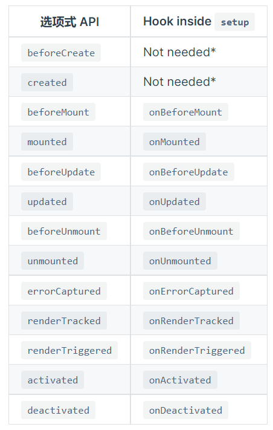

# Vue3新特性梳理

[1.新特性总结](#1)

[2.创建应用实例](#2)

[3.应用挂载](#3)

[4.生命周期](#4)

[5.组件 & 选项](#5)

[6.模板](#6)

[7.动画](#7)

[8.指令](#8)

[8.实例属性与方法](#8)

[9.组合式API](#9)

<span id="1"></span>
## 新特性总结
vue3和vue2对比：
 - 重写了响应式系统、重写了虚拟DOM的实现，性能上得到了提升
 - 新推出组合式API（composition API），使维护组件代码变得更简单
 - 新增了一些功能，如Teleport、Suspense、片段
 - 修改和优化了一些API（生命周期、动画类名），同时移除了一些API（如$children、$listeners、filter）
 - 有更好的TypeScript支持

同时Vue3是向下兼容的，可以使用大部分的Vue2特性。

<span id="2"></span>
## 创建应用实例
从如何创建一个Vue实例说起，Vue2通过new Vue( )创建实例，而Vue3通过Vue.createApp( )创建应用实例：

```javascript
<div id="app">counter: {{counter}}</div>

<script>
  const app = Vue.createApp({
    data(){				
      return {
        counter: 0
      }
    }
  })
  const vm = app.mount("#app") 

  //createApp():创建一个Vue应用实例
  //mount(): 挂载到`id=app`的DOM上
</script>
```

注意应用实例和组件实例的区别：

1.应用实例(app)：
  - Vue.createApp( )返回一个应用实例
  - 应用实例上有很多方法，比如app.component( )注册全局组件，app.directive( )注册全局指令等。而Vue2中它们是全局API，如Vue.component( )
  - 应用实例上的方法大多返回同一应用实例 (mount除外)，所以可以链式操作

  ```javascript
  Vue.createApp({})
    .component('SearchInput', SearchInputComponent)
    .directive('focus', FocusDirective)
    .use(LocalePlugin)
  ```

2.组件实例(vm)：
  - 传递给createApp( )的选项用于配置根组件
  - 将应用实例挂载到一个DOM元素上，返回根组件实例（vm）


<span id="3"></span>
## 应用挂载
将应用挂载到DOM元素上时，Vue3有一点小改变：

  - 有设置template时，Vue2将模板内容替换目标元素，而Vue3将模板内容作为子元素插入
  ```javascript
  <!--Vue2-->
  <body>
    <div id="app"></div>
  </body>
  <script>
    const vm = new Vue({
      template:`<h1>Vue2</h1>`
    })
    vm.$mount("#app")
  </script>

  <!--渲染结果，this.$el指向<h1>-->
  <body>
    <h1>Vue2</h1>
  </body>
  ```

  ```javascript
  <!--Vue3-->
  <body>
    <div id="app"></div>
  </body>
  <script>
    const app = Vue.createApp({
      template:`<h1>Vue3</h1>`
    })
    app.mount("#app")
  </script>

  <!--渲染结果，this.$el指向<h1>-->
  <body>
    <div id="app">
      <h1>Vue3</h1>
    </div>
  </body>
  ```

  - 无template时，Vue2将目标元素的outerHTML当作template，Vue3将目标元素的innerHTML当作template
  ```javascript
  <div id="app">
    <h1>{{msg}}</h1>
  </div>

  //vue3
  Vue.createApp({}).mount('#app')
  //则模板是id为app的元素的innerHTML: <h1>{{msg}}</h1>
  //即this.$el指向h1这个DOM元素


  //vue2
  new Vue({
    el:"#app"
  })
  //模板是id为app的元素的outerHTML: <div id="app"><h1>{{msg}}</h1></div>
  //即this.$el指向div这个DOM元素
  ```

<span id="4"></span>
## 生命周期

### 钩子函数
Vue3的钩子函数与Vue2相比，将beforeDestory、destoryed修改为beforeUnmount、unmounted，增加了renderTracked、renderTriggered、errorCaptured：
 - beforeCreate
 - created
 - beforeMount
 - mounted
 - beforeUpdate
 - updated
 - beforeUnmount
 - unmounted
 - renderTracked
 - renderTriggered
 - errorCaptured

##### errorCaptured （新增）
 - 当捕获到一个后代组件的错误时，会调用errorCaptured
  ```javascript
  errorCaptured(err, errComponent, errInfo){ 
    //err:错误对象
    //errComponent:发生错误的后代组件实例
    //errInfo:包含错误来源的信息
    return true/false 
  }
  ```
 - 函数返回false可以阻止错误继续向上传递（但还是会传递给app.config.errorHandler）

##### renderTracked (新增，状态跟踪，调试用)
 - 此事件告诉你哪个操作跟踪了组件以及该操作的目标对象和键
 - 跟踪虚拟 DOM 重新渲染时调用，可以看作收集依赖时触发，就是渲染依赖了那些数据，当数据变化时会触发，接收一个event对象
 - 状态跟踪在一开始渲染页面时就会触发，触发顺序：beforeMounted - renderTracked - mounted
 - 页面更新也会触发，触发顺序：beforeUpdate - renderTracked - updated
  ```javascript
  //event对象
  {
    effect: {...},
    key: "girls",               //操作的键
    target: {girls:{...},...},  //操作的目标对象
    type: "get"                 //哪个操作跟踪了组件
  }
  ```

##### renderTriggered (新增，状态触发，调试用)
 - 当虚拟DOM重新渲染时触发。和renderTracked类似，接收event对象，此事件告诉你是什么操作触发了重新渲染，以及该操作的目标对象和键
 - 操作页面的显示的数据（引起虚拟DOM重渲染）就会触发，触发顺序：renderTriggered - beforeUpdate


### setup生命周期
setup函数里面设置生命周期函数，是为了使组合式API的功能和选项式API一样完整。
 - setup函数内部的钩子函数基本和选项式一样，只是没有beforeCreate、created，并且在函数前面加上on。
 - 因为setup函数会在beforeCreate之前就执行，即组件创建之前执行。所有beforeCreate、created的代码应该写在setup中
 - 因为还没组件实例，setup中避免使用this，也不能访问以下选项：
   - data
   - computed
   - methods
 - 只能访问以下属性（通过第一个参数props，第二个参数context）：
   - props
   - attrs
   - slots
   - emit

  

<span id="5"></span>
## 组件 & 选项
### 注册组件
注册组件的方法与vue2有略微差别。

vue2：
```javascript
//全局注册
Vue.component("component-name", {
  //...选项
})

new Vue({
  el:"..."
})

//局部注册
const componentA = {}
const componentB = {}


new Vue({
  el:"...",
  components:{
    "component-a": componentA,
    "component-b": componentB
  }
})
```

vue3:

```javascript
//全局注册
const app = Vue.createApp({...})
                        
app.component("name",{...})   //注册组件是应用实例的方法

//局部注册
const componentA = {}
const componentB = {}

const app = Vue.createApp({
  //...
  components:{
    "component-a":componentA,
    "component-b":componentB,
  }
})

app.mount("#app") //挂载
```

### Mixin的合并行为
在vue2中使用Mixin，数据对象在内部会进行递归合并，并在发生冲突时以组件数据优先：
```javascript
const Mixin = {
  data() {
    return {
      user: {
        name: 'Jack',
        id: 1
      }
    }
  }
}

const CompA = {
  mixins: [Mixin],
  data() {
    return {
      user: {
        id: 2
      }
    }
  }
}
```
在vue2中生成的$data：

```javascript
{
  "user": {
    "id": 2,
    "name": "Jack"
  }
}
```

而vue3只是浅层合并：

```javascript
{
  "user": {
    "id": 2
  }
}
```

### 新增选项：emits
- 和props选项类似，props接收父组件传来的数据，emits接收组件可触发的事件：

```html
  <div id="app">
    <p>父组件</p>
    <child @myevent="parentMethod"></child>
  </div>


  <script>
    const child = {
      //触发myevent事件
      template: `<div @click="$emit('myevent')">子组件</div>`,
      emits:['myevent']
    }

    const app = Vue.createApp({
      components:{
        child
      },
      methods:{
        parentMethod(){
          console.log("父组件方法")
        }
      }
    })

    app.mount('#app')
  </script>
```
- 和props一样，emits也可以接收一个对象，允许配置事件验证

```javascript
// 对象语法
app.component('reply-form', {
  emits: {
    // 没有验证函数
    click: null,

    // 带有验证函数
    submit: payload => {
      if (payload.email && payload.password) {
        return true
      } else {
        console.warn(`Invalid submit event payload!`)
        return false
      }
    }
  }
})
```

- Vue强烈建议使用使用emits记录每个组件所触发的所有事件，因为Vue3移除了.native修饰符，没有用emits记录的事件会监听器会被放到组件的$attrs，且默认绑定到组件的根元素。
- 可以使用inheritAttrs：false，让事件还是绑定在设置监听器的元素本身上

### 异步组件 
在vue2中，异步组件通过一个返回promise的函数来创建：
```javascript
Vue.component('async-component', () => import('./async-componnet.vue'))
```
在vue3中，异步组件需要通过defineAsynComponent定义:
```javascript
import { defineAsyncComponent } from 'vue'
app.component('async-component', defineAsyncComponent(()=>import('./async-componnet.vue'))) 

app.component('async-component', defineAsyncComponent(()=>{
    return new Promise((resolve,reject)=>{
        setTimeout(()=>{									//模拟异步
            resolve({
                template:`<div>这是一个异步组件</div>`
            })
        },3000)
    })
}))
```

组件用带选项的写法时，component应该改为loader：
```javascript
import {defineAsyncComponent} from 'vue'
import ErrorComponent from './components/ErrorComponent.vue'
import LoadingComponent from './components/LoadingComponent.vue'

const asyncComponent =  {
  loader: defineAsyncComponent(()=>import('./async-componnet.vue')),
  delay: 200,
  timeout: 3000,
  errorComponent: ErrorComponent,
  loadingComponent: LoadingComponent
}
```

### Suspense
Suspense可以将异步组件提升到组件树中，当异步请求未完成时显示加载中页面，在异步请求完成后即显示该异步组件内容，简化了自己手写处理异步逻辑、显示不同页面的步骤。

用法：
- 在模板中，用<suspence>将想显示的内容包裹
- <suspence>有两个插槽：default和fallback，只能接收一个直接子节点。在default插槽里放置异步组件

```html
<suspense>
  <!-- 加载完成后，显示async-show组件 -->
  <template #default>
    <async-component></async-component>
  </template>

  <!-- 加载还没完成，显示加载中页面 -->
  <template #fallback>
    <h2>loading...</h2>
  </template>
</suspense>
```
asyncComponent应当在setup中返回一个resolve了结果的promise

```javascript
export default defineComponent({
  setup(){
  	return new Promise((resolve,reject)=>{
       axios.get('...').then((rawData)=>{
         resolve({result:rawData})
       })
     })
   }
  
  
  //或者使用 async await，async函数返回值会被Promise.resolve包装成一个期约对象
  async setup(){
    const rawData = await axios.get('https://apiblog.jspang.com/default/getGirl') 
    return {result:rawData.data}
  }
})
```

### Teleport
一些组件，如占满全屏的对话框，如果包裹在其他组件中，就变得容易被干扰，因为样式也将包裹在其它组件中，定位容易变得混乱。
对于这些特殊的组件，既想存在于父组件的逻辑中，又想独立于父组件从而更方便某些操作，就可以使用Teleport瞬移组件：teleport组件允许将组件挂载在任意DOM上。

使用：
假如一个组件，想挂载到id为modal的元素上，则需要被<teleport>包裹，且要用to属性指明挂载点
```html
//modal组件 modal.vue

<template>
  <!-- 会将此组件挂在id为modal的div上 -->
  <teleport to="#modal"> 
    <h2>modal组件</h2>
  </teleport>
</template>
```
```html
// app.vue
<template>
  <!--modal组件将挂这里-->
  <div id="modal"></div>       
  
  <div>
    <h2>teleport组件</h2>

    <!-- 即使组件写在了这里，但会挂载id为modal的元素上，而不是这个app上 -->
    <modal></modal>
  </div>
</template>

<script>
import modal from './components/Modal.vue'
const app = {
  name: "App",
  components:{
    modal         
  }
};
export default app;
</script>
```

<span id="6"></span>
## 模板
### 删除过滤器
在vue2中可以使用过滤器对模板中的数据进行一些格式化：
```html
<div>{{ message | capitalize }}</div>
```
```javascript
export default{
  //...
  filters:{
    capitalize(val){
      if(!val) return ''
      return val.toLowerCase()
    }
  }
})
```
在vue3中删除了过滤器语法，可以用计算属性、方法调用替换。

### 片段
在vue2中，<template>里面只能有一个根元素：
```html
<template>
  <div>
  	......
  </div>
</template>
```
而vue3支持了多跟节点的组件，即片段：
```html
<template>
  <div>...</div>
  <div>...</div>
  <div>...</div>
</template>
```
<span id="7"></span>
## 动画
### <transition>作为根节点
- vue2
vue2使用<transition>作为模板的根节点时，在组件外部，即父组件处也可以触发过渡效果：
```javascript
//子组件
<template>
  <transition>
    <div>子组件</div>
  </transition>
</template>

//父组件
//flag变化会触发过渡效果
<child v-if="flag"></child>
```

- vue3
vue3删除了这个现象，<transition>期望的是被子元素触发。

- 从vue2迁移到vue3
如果想在vue3中继续使用vue2的特性，可以向组件传递prop：
```html
//子组件
<template>
  <transition>
    <div v-if="show">子组件</div>
  </transition>
</template>
<script>
  export default {
    props:['show']
  }
</script>


//父组件
//传递prop
<child :show="flag"></child>
```

### 过渡的类名
vue3将v-enter、v-leave修改为v-enter-from，v-leave-from

### <transition-group>
- vue2
在vue2中，<transition-group>要求有一个根元素包裹内容，默认为<span>，可通过tag属性更改：
```html
<!--根元素为ul-->
<transition-group name="list" tag="ul"> 
    <span v-for="item in items" v-bind:key="item" class="list-item">
      {{ item }}
    </span>
  </transition-group>
```
- vue3
在vue3中不再需要根节点，因为vue3支持了片段。如果依旧写上tag，那么会和vue2一样

<span id="8"></span>
## 指令
### v-model在组件上的使用
- vue2
vue2中，在子组件上绑定v-model="parentVal"，相当于：
```html
<child v-bind:value="parentVal" v-on:input="parentVal = $event"/>
<!--相当于-->
<child v-model="parentVal">
```
子组件内用model选项，可以自定义绑定的属性和事件：
```javascript
export default {
  props:["pValue"],        //<----先使用props接收
  
  model:{                 //<----model选项
    prop:"pValue",				
    event:"update"
  },
  
  template:`
		<input :value="pValue" @input="$emit('update', $event.target.value)"/>
	`
}
</script>
```

- vue3
vue3不再用model选项，而且value必须绑定到 "modelValue" 的prop上，通过emits接收update:modelValue事件：
```javascript
<div id="app">
    <div>父组件数据：{{msg}}</div>
    <child v-model="msg"></child>
  </div>
  
  <script>
    const child = {
      template:`
        <input :value="modelValue" @input="$emit('update:modelValue', $event.target.value)"/>
      `,
      props:["modelValue"],
      emits:['update:modelValue']
    }
    const app = Vue.createApp({
      data(){
        return {
          msg:"123"
        }
      },
      components:{
        child
      }
    })
    app.mount('#app')
  </script>
```
另一种方法是子组件内使用计算属性的getter、setter：
```javascript
const child = {
  template:`
    <input :value="msg"/>
  `,
  props:["modelValue"],
  emits:['update:modelValue'],
  computed:{
    msg:{
      get(){
        return this.modelValue
      },
      set(value){
        this.$emit("update:modelValue", value)
      }
    }
  }
}
```

### v-on.native
- vue3移除了.native修饰符，在vue2中该修饰符用来表示绑定原生事件而不是自定义事件。
- 在vue3中，可通过emits选项定义真正在子组件上会触发的事件，否则会被视为原生事件，并添加到子组件的根元素上（除非子组件设置了inheritAttrs：false）

### v-bind的合并行为
当v-bind绑定的atrribute与独立的atrribute有冲突时，会有优先级问题。

在vue2中，独立的atrribute有更高的优先级：
```html
<!-- 模板 -->
<div id="red" v-bind="{ id: 'blue' }"></div>
<!-- 结果 -->
<div id="red"></div>
```
在vue3中，根据两者的顺序决定优先级
```javascript
<!-- 模板 -->
<div id="red" v-bind="{ id: 'blue' }"></div>
<!-- 结果 -->
<div id="blue"></div>

<!-- 模板 -->
<div v-bind="{ id: 'blue' }" id="red"></div>
<!-- 结果 -->
<div id="red"></div>
```
<span id="9"></span>
## 实例属性与方法
### $attrs 与 $listeners
$attrs和$listeners用于跨层级组件的数据传递。
- 在vue2中，$attrs包括父组件传给子组件、不是props的attribute，且不包括class、style。
- 在vue3中，$attrs包括父组件传给子组件、不是props和emits上的attribute，并且会包括class、style。

- 在vue2中，$listeners是父组件中绑定的事件监听器（不包含有.native修饰符的原生事件）
- 而vue3删除了$listners，没有通过emits接收的事件被统一放到$attrs中

### $children
vue2可通过$children访问当前实例的直接子组件，而vue3删除了$children，如果要访问子组件实例，可以使用$refs。

$refs能访问注册过ref的子组件实例或DOM元素
```html
//refs访问子组件
<child ref="childA"></child>
//取得引用，指向子组件实例
this.$refs.childA


//refs访问元素
<input ref="input"/>
//访问DOM元素
this.$refs.input
```

<span id="10"></span>
## 组合式API
### 为什么需要组合式API
当项目非常复杂时，组件也会越大，逻辑关注点也会分散。

假如一个显示用户的仓库列表的组件，带有搜索功能、筛选功能：
```javascript
// src/components/UserRepositories.vue

export default {
  components: { RepositoriesFilters, RepositoriesSortBy, RepositoriesList },
  props: {
    user: { 
      type: String,
      required: true
    }
  },
  data () {
    return {
      repositories: [], // 1
      filters: { ... }, // 3
      searchQuery: '' // 2
    }
  },
  computed: {
    filteredRepositories () { ... }, // 3
    repositoriesMatchingSearchQuery () { ... }, // 2
  },
  watch: {
    user: 'getUserRepositories' // 1
  },
  methods: {
    getUserRepositories () {
      // 使用 `this.user` 获取用户仓库
    }, // 1
    updateFilters () { ... }, // 3
  },
  mounted () {
    this.getUserRepositories() // 1
  }
}
```
- 1.第一部分的职责是取得用户仓库、监听用户而获取新仓库
- 2.第二部分的职责是搜索仓库
- 3.第三部分的职责是筛选仓库

这些功能被分布在watch、methods、computed里，使得代码难以阅读和理解。

Vue3推出了组合式API的功能，即在组件内开辟一个setup的函数空间，将同一个逻辑关注点的代码放到一起。且从setup()返回的内容可以用于组件其他地方：
```javascript
export default {
  setup(){
    //...
    //setup选项
    return {...}		//<-------setup()返回的内容可以用于组件其他地方
  }
  //...
  //组件内其他选项
}
```
比如将第一部分提炼到setup中，可以用ref（）创建响应式变量：
```javascript
import { fetchUserRepositories } from '@/api/repositories'
import { ref } from 'vue'

export default {
setup (props) {
  const repositories = ref([])  		//<----ref( )创建响应式变量
  const getUserRepositories = async () => {
    repositories.value = await fetchUserRepositories(props.user)
  }

  return {
    repositories,
    getUserRepositories
  }
}

//组件的其他部分
//......
}
```

### 创建响应式变量
- **ref( )**
生成响应式数据，通过其value属性取得值。如果refs数据发生变化，会更新视图。（如果使用单文件组件，应该先引入ref再使用，以下例子均不是单文件组件形式）。
```javascript
<div id="app">
  {{msg}}
</div>

<script>
  const app = Vue.createApp({
    setup(){
      const msg = Vue.ref('msg')	
      console.log(msg.value) 		//'msg'，通过value属性访问其值
      return {
        msg 	//从 setup 返回的 refs 在模板中访问是被自动浅解包的，
        			//因此不应在模板template中使用 .value
      }
    }
  })
  app.mount('#app')
</script>
```
- **reactive( )**
返回对象的响应式副本。如果传入的是refs，会解包所有深层的refs，同时保持它们的响应式。和ref相比，reactive无需使用value访问值
```javascript
setup(){
  const obj = Vue.ref({
      name:'6fa',
      age: 3
    })
  const reactiveData = Vue.reactive(obj)
  console.log(reactiveData.name) 					//不用通过value访问值
  return {
    reactiveData
  }
},
mounted(){
  setTimeout(()=>{
    this.reactiveData.age = 18			//会检测到变化
  },3000)
}
```

- **ref( )与reactive( )的区别**
  - 参考： [Vue.js 3 中 ref 和 reactive 有何区别？](https://learnku.com/vuejs/t/60866) 
  - ref本质是通过reactive创建的：ref(param)等同于reactive({value: param})。
  - 因此ref也是接收对象的，但是引用类型放reactive可以减少一层转换开销
  - reactive不能接受基本类型数据，会没有响应性

- **toRefs( )**
将响应式对象转换为普通对象，但是普通对象里面的属性依然是响应式的（会在内部指向原对象响应属性的ref）。所以常用于将setup返回的响应式对象进行解构：
```html
  <div id="app">
    <!--直接使用属性-->
    {{name}}:{{age}}      
  </div>
  <script>
    const app = Vue.createApp({
      setup(){
        const data = Vue.reactive({
          name:'6fa',
          age: 3
        })
        const refsData = Vue.toRefs(data) //将data里的属性全转成ref
        return {
          ...refsData   //<---可以进行解构但没有影响其属性的响应式
        }
      }
    })
    const vm = app.mount('#app')
  </script>
```

### setup参数
- setup接收props和context作为参数，且props是响应式的：
```javascript
export default {
  props:['msg'],
  setup(props, context){
    //props是一个代理对象：Proxy {msg:'...'}
    
    //因为props是响应式的，所以不能解构：
    let {msg} = props 	//<----解构之后会变成普通属性，不具有响应式
    
    //可以使用toRefs实现解构
    let {msg} = toRefs(props)
  }
}
```
- context暴露了组件的三个属性：attrs、slots、emit
```javascript
setup(props,context){
  //因为context是非响应式的，所以可以解构
  let {attrs, slots, emit} = context
  
  //Attributes，非响应式对象
  console.log('attrs',attrs)
  //插槽，非响应式对象
  console.log('slots',slots)
  //触发事件
  console.log('emit',emit) 
}
```

### watch函数
在组件选项中使用watch选项监测数据变化，在setup函数中，可以导入watch函数来实现同样的功能。
- 参数
watch函数接收三个参数：响应式数据或者getter函数、回调函数、配置对象
```javascript
//单文件组件中：xx.vue

import {ref, watch} from 'vue'
//监听单个数据源
export default {
  setup(){
    const data = ref(10)
    watch(data, (newVal, oldVal)=>{
      console.log(newVal,oldVal)
    })
  }
}
```
监听多个数据源可以传入数组：
```javascript
setup(){
  const data1 = ref(10)
  const data2 = ref(20)
  watch([data1,data2], (newVal, oldVal)=>{
    console.log(newVal, oldVal)  //<----结果也是数组
  })
}
```

	想监听嵌套的响应式对象时，可以设置配置对象属性：deep
	```javascript
    setup(){
      const obj = reactive({
        name:'6fa',
        friends:{
          a:'friendA'
        }
      })

      //第一个参数使用getter函数形式
      watch(
        ()=>obj, 
        (newVal,oldVal)=>{
          console.log(newVal.frineds.a, oldVal.frineds.a)
        },
        // {deep:true}
      )

      obj.frineds.a = 'newFriendA'  //没有deep:true，这句将会没反应
    }
	```

- 监听响应式对象
当直接传递引用对象时，可以看到新值、旧值是一样的，因为“侦听一个响应式对象或数组将始终返回该对象的当前值和上一个状态值的引用”。
```javascript
setup(){
  const obj = reactive({
    name:'6fa',
    friends:{
      a:'friendA'
    }
  })
  
  watch(
    ()=>obj, 
    (newVal,oldVal)=>{
      console.log(newVal.frineds.a, oldVal.frineds.a)
    },
    {deep:true}
  )
  
  obj.frineds.a = 'newFriendA' //'newFriendA'  'newFriendA'
}
```
可以解构源响应式对象，创建源对象的值副本：
```javascript
setup(){
  const obj = reactive({
    name:'6fa',
    friends:{
      a:'friendA'
    }
  })
  
  watch(
    ()=>({...obj}),    //<----注意这里
    (newVal,oldVal)=>{
      console.log(newVal.frineds.a, oldVal.frineds.a)
    },
    {deep:true}
  )
  
  obj.frineds.a = 'newFriendA' //'newFriendA'  'friendA'
}
```
但是上面也仅仅是解决一层嵌套，如果obj里面含有多层嵌套的对象：
```javascript
setup(){
  const obj = reactive({
    name:'6fa',
    friends:{
      a:'friendA',
      b:{
        name:'friendB'
      }
    }
  })
  
  watch(
    ()=>({...obj}), 
    (newVal,oldVal)=>{
      console.log(newVal.frineds.b.name, oldVal.frineds.b.name)
    },
    {deep:true}
  )
  
  obj.frineds.b.name = 'newFriendB' //'newFriendB'  'newFriendB'  <---新旧值一样
}
```
因此如果想完全侦听深度嵌套的对象/数组，需要对值进行深拷贝。
<br>
- 多个同步更改只触发一次侦听器
```javascript
setup(){
  const obj = reactive({
    name:'6fa',
    friends:{
      a:'friendA'
    }
  })
  
  watch(
    ()=>({...obj}),   
    (newVal,oldVal)=>{
      console.log(newVal, oldVal)
    },
    {deep:true}
  )
  
  onmounted(()=>{
      obj.frineds.a = 'newFriendA'
  		obj.name = 'newName'         //同一个函数里面同时更改被监听数据，只触发一次watch
  })
}
```

### watchEffect函数
参考：[Vue3 中 watch 与 watchEffect 有什么区别？](https://www.zhihu.com/question/462378193)
watchEffect的作用和watch差不多，用于在依赖的数据更新时重新执行操作。

watchEffect接收一个函数，并将它立即执行，等依赖变更时重新执行这个函数：
```javascript
setup(){
  let num = ref(10)
  watchEffect(()=>{
    console.log(num.value)  //立即运行: 10
  })
  setTimeout(()=>{
    num.value = 20   //3秒后: 20
  },3000)
}
```
watchEffect返回一个停止函数：
```javascript
setup(){
  let num = ref(10)
  let stop = watchEffect(()=>{
    console.log(num.value)  //立即运行: 10
  })
  setTimeout(()=>{
    num.value = 20   //3秒后不会运行
  },3000)
  
  //可以停止watchEffect
  stop()
}
```
它和watch的主要差别是，watch是显示指定了依赖源，且可以接收到新值和旧值；而watch会自动收集依赖源，且回调会被立即执行一次：
```javascript
setup(){
  let num = ref(10)
  
  watch(num, (newVal, oldVal)=>{  //显示指定num为依赖源
    console.log(newVal, oldVal)
  })
  
  watchEffect(()=>{
    console.log(num.value)   //自动将num视为依赖源
  })
}
```

相比之下，使用watch可以避免不必要的重复触发：
```javascript
let num = ref(10)
let flag = ref(true)

watchEffect(()=>{
  console.log("触发watchEffect")
  if(flag.value){
    console.log(num.value)
  }
})
//输出：
//"触发watchEffect"
//10

flag.value = false
num++

//虽然flag.value为false，num已经没有用了，但是还是会触发watchEffect
//输出："触发watchEffect"
```
### computed函数
和watch类似，也可导入computed函数来独立使用。

computed接收两个参数：
- 第一个参数是getter函数，并自动给getter函数的返回值包装成只读的ref引用。
```javascript
const num = ref(10)
const double = computed(()=>num.value*2)

double.value = 80  //返回的是ref引用，通过value属性尝试赋值

console.log(double.value) //20，赋值失败
```
- 如果想返回可写的ref对象，可以同时设置getter、setter：
```javascript
const double = computed({
  set: ()=>num.value*2,
  get: val=>{
    num.value = val
  }
})
```
- computed函数第二个参数是带有onTrack、onTrigger选项的对象，主要用于调试，仅在开发模式生效。
```javascript
const double = computed({
  set: ()=>num.value*2,
  get: val=>{
    num.value = val
  }
},{
   onTrack(e){
    // 当 num.value 作为依赖被追踪时触发
    console.log(e)  
    //{effect: ReactiveEffect, target: RefImpl, type: 'get', key: 'value'}
  },
  onTrigger(e){
    // 当 num.value 被修改时触发
    console.log(e)   
    //{effect: ReactiveEffect, target: RefImpl, type: 'set', key: 'value', newValue: xx}
  }
})
```

### 组合式函数（函数式组件）
将同一逻辑的代码放到setup中可以解决关注点分离的问题，但是当setup函数本身也越来越大时，就失去了意义。

组合式函数即将同一个功能块的代码提取到一个独立的函数中，减轻setup负担且代码能更好复用。一个组合式函数即一个独立的setup函数：
```javascript
//搜索功能模块: src/hooks/useSearch.js
export default function search(searchQuery){
  const getSearchResult = ()=>{}
  //...
  return {
    getSearchResult,
    //...
  }
}
```
组件内引入组合式函数使用：
```javascript
// src/components/user.vue
import useSearch from '@/hooks/useSearch.js'
import {ref} from 'vue'

export default {
  setup(){
    const searchQuery = ref('...')
    const {getSearchResult} = useSearch(searchQuery)
    //...
  }
  
  return {
  	//...
	}
}
```
Vue2也有函数式组件，但是是无状态的，即没有响应式数据，因此渲染开销比较低，性能得到一定提高。
然而Vue3的有状态的函数组件性能也提升了，除了特别简单的组件（如创建动态标题的组件），建议使用有状态的组件。

### Provide & Inject
provide和inject用于跨层级组件间的通信，在setup中使用provide和inject时，需要显示导入provide函数、inject函数。

provide函数接受两个参数：
- name
- value（value可以是各种类型）

inject函数也接受两个参数：
- 要注入的属性名
- 可选的默认值

使用：
```javascript
//父组件provide
import child from '@/componnets/child'
import {provide} from 'vue'

export default {
  components:{
    child
  },
  setup(){
    provide('name','John')
    provide('family',{
      father:'father',
      brother:'brother'
    })
  }
}
```
```html
//子组件inject

<template>
  <div>子组件</div>
  <div>name:{{name}}</div>
  <div>family:{{family}}</div>
</template>

<script>
  import {inject} from 'vue'
  
  export default {
    setup(){
      const obj = {
         father:'father',
         mother:'mother'
      }
      const name = inject('name', 'default name') 
      const family = inject('family',obj)
      return {
        name,
        family
      }
    }
  }
</script>
```

但是provide/inject不是响应式的，在子组件inject数据后，父组件修改数据，子组件并不会更新。

如果想让数据变成响应式的，可以用ref、reactive包装想provide的数据：
```javascript
//父组件
setup(){
  const obj = reactive({ 			 //<---变成响应式数据
     father:'father',
     mother:'mother'
  })
  Vue.provide('name','John')
  Vue.provide('family',obj)
}
```
注意inject数据的组件不应直接修改数据，应当由provide数据的组件修改数据。如果inject数据的组件内部想更新inject的数据，可以provide时同时provide一个修改方法：

```javascript
//父组件
setup(){
  const obj = reactive({ 			 //<---变成响应式数据
    father:'father',
    mother:'mother'
  })
  const updateFn = (val)=>{
    obj.sister = val
  }
  provide('family',obj)
}
```
```javascript
//子组件
setup(){
  const family = inject('family')
  const updateFn = inject('update')
  updateFn('sister')  //子组件改变数据
  return {
    family
  }
}
```
如果想确保inject数据的组件不会直接更改数据，可以使用readonly函数：
```javascript
provide('family',readonly(obj))
```