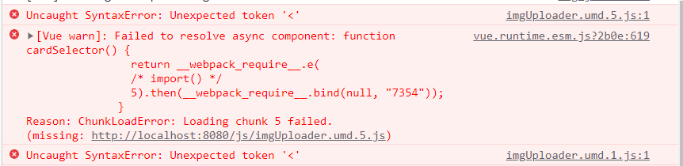
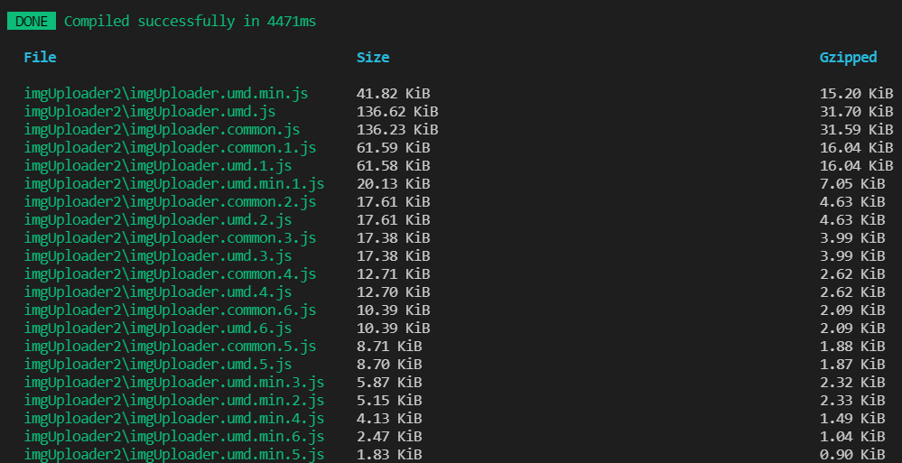
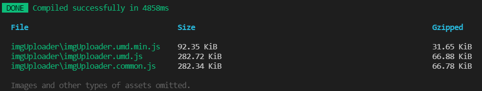
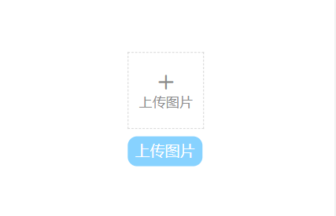

## 问题
事情起因是我写了一个基于vue的图片上传插件，用vue cli打包为库后，想在本地引入umd包来测试插件能不能用，结果报错，主要是Unexpected token '<' 和 ChunkLoadError：Loading chunk xx failed：



点入报错的文件链接，发现是DOCTYPE标签错误：


搜索一番后，基本可以确定是引入错误，但是不知道原因。

## 尝试解决
在搜索引擎挣扎许久，也尝试过更改publicPath、添加@babel/plugin-transform-modules-umd等均无效，主要是不知道根本原因。

在看到这两篇博文（[webpack之Loading chunk x failed](https://www.novenn.com/webpack%E4%B9%8BLoading-chunk-x-failed/) 、[Vue CLI build --target lib 时如何避免打包成多个umd.js文件](http://www.zuo11.com/blog/2020/11/vue_umd_multiple.html)）后，联系结合，猜测原因是分包加载错误：webpack打包库会将代码分成多个包（看下图），在vue项目中只引入 *.umd.js，但是其他分包没有按顺序引入，因为被浏览器拦截请求篡改了分包内容（具体可见上面提及的第一篇博文），不能保证代码的顺序执行。



那么可以尝试将代码打包为一个文件，这样不需要保证script代码执行顺序，试试是否奏效。

需要修改vue.config.js：

* 限制打包为一个包
* 修改css.extract为false，表示不将css文件单独抽离，免得用户自己导入 CSS

```javascript
// vue.config.js
const webpack = require("webpack");
module.exports = {
  css: {
    extract: false
  },
  configureWebpack: {
    plugins: [
      // 限制只打一个包，不分Chunk
      new webpack.optimize.LimitChunkCountPlugin({
        maxChunks: 1
      })
    ],
    // 当库里面引入了比较大的文件时，为了不影响主包大小，需要设置下该包使用外部引入
    externals: {
      echarts: "echarts"
    }
  }
}; 

```

再次打包：



尝试引入使用，果然成功了：



## 总结
虽然依着上面的思路问题是解决了，但是是否就是这个原因，本人也无法十分确定（也许是歪打正着了 :) ）。

如果有人有更好的想法，欢迎讨论^_^


## 参考
[webpack之Loading chunk x failed](https://www.novenn.com/webpack%E4%B9%8BLoading-chunk-x-failed/) 
[Vue CLI build --target lib 时如何避免打包成多个umd.js文件](http://www.zuo11.com/blog/2020/11/vue_umd_multiple.html)