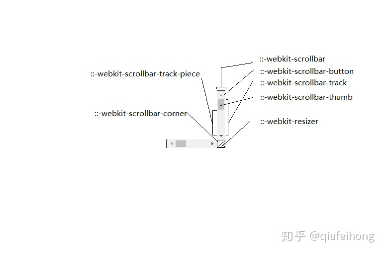
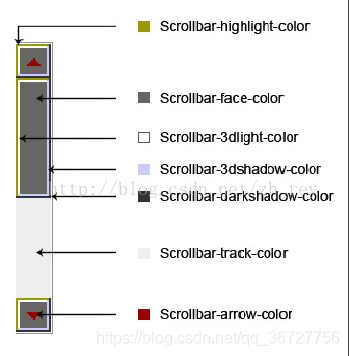
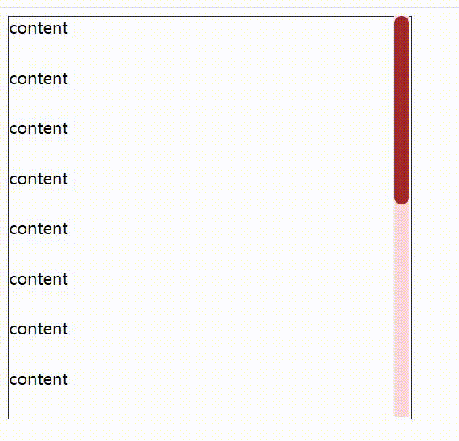
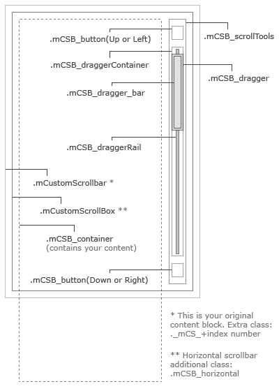

# 滚动条常用知识点总结

参考：

- [自定义浏览器滚动条样式（兼容chrome和firefox）](https://daotin.netlify.app/sxemmx.html)
- [::-webkit-scrollbar](https://developer.mozilla.org/zh-CN/docs/Web/CSS/::-webkit-scrollbar)
- [【CSS】滚动条样式的优化](https://zhuanlan.zhihu.com/p/110029332)
- [这个大概是修改滚动条样式方法最全的文章了](https://juejin.cn/post/6844904004879843336)

## 隐藏滚动条
先将元素设置为可滚动的：

```css
div {
  height: 200px;
  overflow: scroll; //或auto
}
```

webkit写法：

```css
div::-webkit-scrollbar {
  width: 0;
  height: 0;
  background-color: transparent;
}

// 或
div::-webkit-scrollbar {
  display:none;
}
```

IE10+：

```css
div {
  -ms-overflow-style: none; 
}
```

Firefox：

```css
div {
  scrollbar-width: none; 
}
```

## 修改默认样式

### webkit
webkit滚动条的选择器：



- ::-webkit-scrollbar——整个滚动条
- ::-webkit-scrollbar-button——滚动条上的按钮（上下箭头）
- ::-webkit-scrollbar-thumb——滚动条上的滚动滑块
- ::-webkit-scrollbar-track——滚动条轨道
- ::-webkit-scrollbar-track-piece——滚动条没有滑块的轨道部分
- ::-webkit-scrollbar-corner——当同时有垂直滚动条和水平滚动条时交汇的部分
- ::-webkit-resizer——右下角可拖动调整大小的滑块

比较常用的是修改宽度、圆角和颜色：

```css
  div::-webkit-scrollbar {
    width: 10px;
  }
  /* 滑块 */
  div::-webkit-scrollbar-thumb {
    border-radius: 25px;
    background-color: rgb(81, 81, 255);
  }
  /* 轨道 */
  div::-webkit-scrollbar-track {
    background-color: rgb(218, 255, 255);
  }
```

还可以用伪类来更精确控制滚动条样式：
- :horizontal
  - 选择水平方向的滚动条
- :vertical
  - 选择垂直方向滚动条
- :decrement
  - 选择上按钮（垂直滚动条）、左按钮（水平滚动条）
  - 选择滑块上方的轨道碎片(track piece)（垂直滚动条）、滑块左方的轨道碎片（水平滚动条）
- :increment
  - 与:decrement相反
- :start
  - 选择滑块前方的按钮或轨道碎片(track piece)
-  :end
  - 选择滑块后方的按钮或轨道碎片(track piece)
- :double-button 
  - 适用于按钮和轨道碎片
  - 用于判断按钮是不是滚动条同一端的一对按钮中的一个，或轨道结束的位置是否是一对按钮
-  :single-button 
  - 适用于按钮和轨道碎片
  - 判断按钮是滚动条一端的独立一个，或轨道结束的位置是否是一个独立按钮
- :no-button 
  - 适用于轨道碎片，选择滚动条两端没有按钮时的轨道碎片
-  :corner-present 
  - 是否存在滚动条角落
- :window-inactive 
  - 焦点不在该窗口时

比如选择滑块的上部分轨道：

```css
 div::-webkit-scrollbar-track-piece:start { }
```

### IE
IE浏览器的滚动条只能修改颜色，无法改变宽度等。它的选择器如下：
- scrollbar-3dlight-color：立体滚动条亮边的颜色
- scrollbar-3dshadow-color：立体滚动条阴影的颜色
- scrollbar-highlight-color：滚动条空白部分的颜色
- scrollbar-darkshadow-color：立体滚动条强阴影的颜色
- scrollbar-face-color:  立体滚动条的颜色
- scrollbar-arrow-color：三角箭头的颜色
- scrollbar-track-color：轨道颜色
- scrollbar-base-color：滚动条的基本颜色



### Firefox
Firefox的滚动条只能修改宽度（属性scrollbar-width）和颜色（属性scrollbar-color）。

scrollbar-width值：
- auto：默认宽度
- thin：更窄的滚动条
- none：隐藏滚动条

scrollbar-color值：
- auto：默认颜色
- light：浅色滚动效果
- dark：深色滚动效果
- 具体颜色值，可传两个值，第一个滚轮颜色，第二个滚动条背景色
  - 如scrollbar-color: red white; 

## JS实现滚动条
使用一个容器包裹内容和滚动条：

```html
<div class="box-wrap">
  <div class="box">
    <div>content</div>
    <div>content</div>
    <div>content</div>
    <div>content</div>
    <div>content</div>
    <div>content</div>
    <div>content</div>
    <div>content</div>
    <div>content</div>
    <div>content</div>
    <div>content</div>
    <div>content</div>
    <div>content</div>
    <div>content</div>
    <div>content</div>
    <div>content</div>
    <div>content</div>
  </div>
  
  <div class="scroll">
    <div class="scroll__thumb"></div>
  </div>
</div>
```

样式上注意将滚动条隐藏，以及将滚动条定位到右边：

```css
.box-wrap {
  position: relative;
  height: 400px;
  width: 400px;
}
.box {
  height: 100%;
  width: 100%;
  border: 1px solid rgb(52, 45, 45);
  overflow: scroll;
}
.box::-webkit-scrollbar{
  display: none;
}

.box div {
  height: 50px;
}

.scroll {
  position: absolute;
  right: 0;
  top: 0;
  background-color: rgb(255, 218, 218);
  width: 15px;
  height: 100%;
}
.scroll__thumb {
  position: absolute;
  right: 0;
  top: 0;
  width: 100%;
  border-radius: 20px;
  background-color: brown;
}
```

js要点：
- 将内容元素高度比上它的滚动高度，得到滑块高度
- 监听滚动事件，移动滑块

```javascript
const boxWrap = document.querySelector('.box-wrap')
const box = document.querySelector('.box')
const thumb = document.querySelector('.scroll__thumb')

const boxHeight = boxWrap.clientHeight
const contentHeight = box.scrollHeight

const persent = boxHeight / contentHeight

thumb.style.height = persent*100 + '%';//滑块高度

box.addEventListener('scroll', (e) => {
  thumb.style.transform = 'translateY(' + (e.target.scrollTop / boxHeight)*100 + '%)'
})
```

效果图：



这样只是简单实现了滚动效果，没有完善其他的功能比如滑块可拖动、高度不够时不显示滚动条等，~~懒人~~建议使用封装好的插件。

## 滚动条插件mCustomScrollbar

插件的使用也很简单，直接在页面中引入它的js和css文件（[文件下载地址](https://github.com/malihu/malihu-custom-scrollbar-plugin/archive/master.zip)）：

```html
<link rel="stylesheet" href="/css/jquery.mCustomScrollbar.css" />

<!--插件基于JQuery,因此也需要引入JQuery-->
<script src="https://ajax.googleapis.com/ajax/libs/jquery/1.11.1/jquery.min.js"></script>
<script src="/path/to/jquery.mCustomScrollbar.concat.min.js"></script>
```

可以通过js初始化，或通过html上添加class，需要注意的是滚动元素应该具有高度，且overflow属性为hidden或auto：

```javascript
(function($){
  $(window).on("load",function(){
    $(".content").mCustomScrollbar();
  });
})(jQuery);
```
```html
<!-- data-mcs-theme表示滚动条主题颜色 -->
<div class="mCustomScrollbar" data-mcs-theme="dark">
  <!-- your content -->
</div>
```

一些常用配置：

```javascript
// 设置水平、垂直，或同时两个方向的滚动条
$(".content").mCustomScrollbar({
    axis:"x" // 水平
});
$(".content").mCustomScrollbar({
    axis:"y" // 垂直
});
$(".content").mCustomScrollbar({
    axis:"yx" // 垂直、水平
});


// 设置主题
$(".content").mCustomScrollbar({
    theme:"dark"  //默认light
});

// 滚动条位置
$(".content").mCustomScrollbar({
    scrollbarPosition: "inside" // 或"outside"
});

// 是否自动隐藏滚动条
$(".content").mCustomScrollbar({
    autoHideScrollbar: true
});

// 是否支持键盘按键滚动
$(".content").mCustomScrollbar({
   keyboard:{ enable: true }
});

//.......
```

常用方法：

```javascript
// 滚动到某位置
$(selector).mCustomScrollbar("scrollTo",position,options)

// 例子
$(selector).mCustomScrollbar("scrollTo","bottom",{
  scrollInertia:3000, //持续时间
  scrollEasing:"easeOut", //过渡效果
});

// 禁用滚动条
 $(selector).mCustomScrollbar("disable")

// 停止滚动事件
$(selector).mCustomScrollbar("stop")
```

如果想自己设置滚动条样式，可以通过自定义主题：

```javascript
$(selector).mCustomScrollbar({
    theme:"test"
});
```

mCustomScrollbar会给元素生成mCS-test（mCS-主题名称）的类，可以通过该类来控制样式：

```css
.mCS-test.mCSB_scrollTools .mCSB_dragger {
  ......
}
.mCS-test.mCSB_scrollTools .mCSB_dragger .mCSB_dragger_bar{ 
  ......
}
.mCS-test.mCSB_scrollTools .mCSB_draggerRail{ 
  ......
} 
......
```



更多详细用法可以查看[官网](http://manos.malihu.gr/jquery-custom-content-scroller/)。