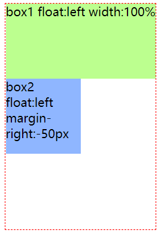
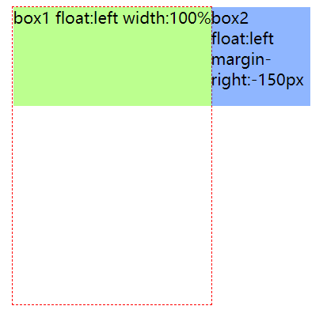

# margin负值

在学习双飞翼布局、圣杯布局时对于margin负值的理解比较混乱，于是从demo开始测试，记录一下对于margin负值的理解和总结。

如有错误，请一定要指正~

### margin的参考线
首先要对margin的参考线有一点印象，它是元素或者元素margin线移动的基准。

对于top、left，margin参考线是包含块的上边缘、左边缘，或者相邻元素的下margin线、右margin线；<br>
对于right，bottom，参考线是元素自身的右、底border线。

关于上面提到的包含块，一般是父元素的内容区域，但很多情况下包含块是不同的区域。

## 包含块
包含块是用来 计算元素某些属性 和 定位 的一个框，比如width、height、padding、margin等的百分比值、定位元素的偏移值等，都是依据包含块的。

包含块的范围由属性的display属性决定的：
1. 属性的display: static/relative/sticky
包含块的范围，即最近的祖先块元素的内容区域（content区域）

2. 属性的display：fixed
如果是连续媒体（即没有间断的上下文环境，如我们现在看的网页），包含块是视口；

如果是分页媒体，包含块是分页区域；

如果最近父元素的transform值不为none，那么包含块为这个父元素的内边距边缘。（即padding加上content区域）

3. 属性的display：absolute
包含块是最近的position不是static的祖先元素，其内边距边缘组成。

如果最近父元素的transform值不为none，那么包含块为这个父元素的内边距边缘。

## margin的正负值
对于top、left，正值是元素与参考线反向移动，负值元素朝着参考线方向移动；

对于right、bottom，正值时右、下margin线朝着右边、下边移动，负值时右、下margin线朝着左边、上边移动。

对于普通流里的块元素，right、bottom的负值，自身不会受什么影响（但是邻近元素受影响）；对于定位元素，right、bottom为负值，某些条件下，元素自己也会移动。具体请看下面demo。

## demo
html代码:
```
  <div class="box-wrap">
    <div class="box1">box1</div>
    <div class="box2">box2</div>
    <div class="box3">box3</div>
  </div>
```

css代码：
```
.box-wrap {
    border: 1px dashed red;
    width: 200px;
    height: 300px;
  }
  .box1,
  .box2,
  .box3
    {
      width: 100px;
      height: 100px;
  }
  .box1 {
    background-color: rgba(102, 255, 0, 0.5);
  }
  .box2 {
    background-color: rgba(0, 89, 255, 0.5);
  }
  .box3 {
    background-color: rgba(255, 245, 101, 0.5);
  }
```

效果如下图：


#### demo1：元素还在常规流时，如position：static/relative时

给box2加上margin-left: -50px，元素往包含块的左边移动了：


再换成margin-right: -50px看看：


可以看到元素没有移动。

但是根据上面所说的参考线，其实元素的margin线往左移动了50px。而元素没有移动，是因为默认情况下，元素按照它的左margin线定位（此定位只是指在容器内排列的位置）在容器内，而此时左margin线没有变，故元素没有移动。

box2再换成position:relative; right: 50px; margin-right: -200px;时：


可以看到元素box2只是按照right: 50px移动了，而margin-right没有起作用。这是因为position:relative并没有使元素离开普通流，依然是按照元素左margin线定位的。（margin-right为正为负都一样不起移动作用）

#### demo2：元素脱离了正常流时，比如position:absolute和float

给box-wrap加上position:relative; 给box2加上position:aboslute; right:0;

可以看到box3上来了，说明box2脱离了常规流：


再给box2加上margin-right:-50px; 效果如下：


说明margin-right使元素移动了，这是因为脱离普通流的元素，且它以右边margin线来定位它的位置（上面的right：0），当改变它右margin线时（margin-right:-50px）, 元素的位置就变了。

可以试试正margin-right，元素一样会移动，但是试试把margin-right：-50px 变成 margin-left:-50px：


元素没有移动了，这再次验证了上面的说法。float也是同理。

#### demo3：元素如何移动到上一行

上面的元素移动都是在一行移动的，因为上一行是普通流中的块元素，占据了一整行。

当元素是浮动元素且上一行也是浮动元素的情况下，元素是可以向上移动的。

给box1和box2设置为浮动元素，且box1宽度为100%（为方便观察，去掉了box3）：


给box2分别设置margin-left:-50px和-100px：


可以看到当元素从左边完全移出包含块时，会浮动到上一行，且可以覆盖box1。

那么对于margin-right呢？






可以看到-50px时，元素没有移动，但是右margin线其实已经向左移动了50px了。

当为-100px时，右margin线刚好出了包含块，元素上移。当为-150px，其实右margin线移动了，但是元素是float:left，以左margin线定位的，故右margin线的变化对元素移动无影响。

双飞翼、圣杯布局的实现原理就是如此，将全部元素浮动，再以负margin将下方的元素移动到上一行。

#### 附上双飞翼布局和圣杯布局代码：

双飞翼和圣杯布局都是中间自适应、两边固定的布局，主要区别在于：圣杯布局使用padding预留两侧空间，而双飞翼布局采用margin预留两侧空间。

圣杯：
```html
<!DOCTYPE html>
<html lang="en">
<head>
  <meta charset="UTF-8">
  <meta name="viewport" content="width=device-width, initial-scale=1.0">
  <title>Document</title>
  <style>
    body {
      padding: 0;
      margin: 0;
      min-width: 400px;
    }
    .header,.footer {
      height: 50px;
      background-color: pink;
    }
    .center{
      background-color: lightblue;
    }
    .left,.right {
      background-color: lightgray;
      height: 200px;
      width: 100px;
    }

    /* 布局 */
    .center,.left,.right {
      float: left;
    }
    .main {
      /* 不能写width: 100%; 不然加上padding则超出了 */
      padding: 0 100px;
    }
    .main::after{
      content: '';
      display: block;
      clear: both;
    }
    .center {
      width: 100%; 
    }

    .left {
      position: relative;
      margin-left: -100%; 
      left: -100px;
    }
    .right {
      margin-right: -100px;
    }
  </style>
</head>
<body>
  <div class="header">header</div>

  <div class="main">
    <div class="center">center content</div>
    <div class="left">left side</div>
    <div class="right">right side</div>
  </div>

  <div class="footer">footer</div>
</body>
</html>
```

双飞翼:
```html
<!DOCTYPE html>
<html lang="en">
<head>
  <meta charset="UTF-8">
  <meta name="viewport" content="width=device-width, initial-scale=1.0">
  <title>Document</title>
  <style>
    body {
      padding: 0;
      margin: 0;
      min-width: 400px;
    }
    .header,.footer {
      height: 50px;
      background-color: pink;
    }
    .center{
      background-color: lightblue;
    }
    .left,.right {
      background-color: lightgray;
      height: 200px;
      width: 100px;
    }

    /* 布局 */
    .center-wrap,.left,.right {
      float: left;
    }
    .main::after{
      content: '';
      display: block;
      clear: both;
    }

    .center-wrap {
      width: 100%;
    }
    .center {
      margin: 0 100px;
    }
    .left {
      margin-left: -100%;
    }
    .right {
      margin-left: -100px;
    }
  </style>
</head>
<body>
  <div class="header">header</div>

  <div class="main">
    <div class="center-wrap">
      <div class="center">center content</div>
    </div>
    <div class="left">left side</div>
    <div class="right">right side</div>
  </div>

  <div class="footer">footer</div>
</body>
</html>

```

圣杯布局的效果和双飞翼是一样的：


