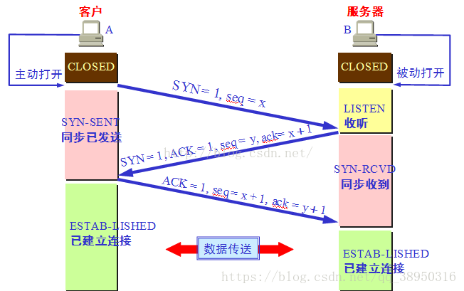

## 前言
文章内容基本上为《图解HTTP》这本书的知识点总结，一些相关知识点解释会引用其他书/博主写的内容。

学习HTTP的起因是一道很常见的题目：输入一个url地址到显示页面，中间发生了什么。这就涉及到了互联网通信协议TCP/IP协议族，其中HTTP协议为其中一个子集。《图解HTTP》从TCP/IP协议讲起，前半部分比较全面地介绍了通信传输流如何传输、相关协议及相应负责的功能，后半部分详细介绍HTTP协议。

如有错误的地方，欢迎指正~

## TCP/IP协议族是什么
两台计算机想要相互通信，就要基于相同的规则（如何探测到通信目标、使用哪种语言通信、web页面显示的步骤处理、怎样结束通信等），我们把这种规则称为 协议 （protocol），把互联网相关的协议的集合称为TCP/IP协议族。

## 分层概念
我们将TCP/IP协议族分为 应用层、传输层、网络层、链路层。
为什么要分层呢？
1. 更改方便：如果互联网只有一个协议统筹，某个地方需要更改设计时就要整体替换。分层后，把各个层之间的接口规划好，每个层的内部能够自由改动。
2. 设计更简单：每个层可以只考虑自己的部分。

### 应用层
决定了向用户提供应用服务时通信的活动（即向用户提供应用程序，比如电子邮件/文件传输访问等）。FTP（文件传输协议）、HTTP、DNS（域名系统）、URI（统一资源标志符）、SSH（安全外壳协议）等都属于该层的协议。
### 传输层
对应用层，提供处于网络连接中的两台计算机之间的数据传输（提供应用程序间的通信）：格式化信息流、提供可靠传输。
传输层有两个性质不同的协议：TCP（传输控制协议）、UDP（用户数据报协议）。
### 网络层
处理在网络上流动的数据包（数据被分割成更小的包，即网络传输的最小数据单位），规定了传输路线，并把数据包传送给对方。
网络层协议有IP、RIP、ICMP等
### 链路层
其实可以分为数据链路层和物理层。
数据链路层负责封装和解封装IP报文，发送和接受ARP（地址解析协议）/RARP（逆地址解析协议）报文等。
物理层以二进制数据形式在物理媒体上传输数据。


## 通信传输流
既然知道了TCP/IP协议的分层，就要来看看数据如何在这些层之间传输。

网络通信时，会通过分层顺序与对方进行通信。发送端从应用层往下走，接收端从链路层往上走。
以HTTP协议为例子：
1. 客户端在应用层（HTTP协议）发出HTTP请求（此时有用到URI，以及域名系统DNS协议解析域名，得到主机的ip），（将 想要访问的服务器页面资源 结合自己的本机信息）生成HTTP请求报文
2. 传输层（TCP协议）接受到HTTP请求报文，将数据进行分割，并且打上标记序号和端口号等信息（TCP首部），转发给网络层
3. 网络层（IP协议）增加作为通信目的的MAC地址，生成带有IP首部的数据包（网络层主要负责物理地址（MAC）和逻辑地址（IP）的转换），转发给链路层。
ps：MAC地址是物理地址，指网卡所属的固定地址；IP地址是逻辑地址，是节点被分配到的地址
4. 接受端的服务器 在 链路层接收到数据，（把数据封装成帧），按顺序往上层发送，每过一层删除首部。


## IP协议（负责传输）
IP协议（网际协议）位于网络层，几乎所有使用网络的系统都会用到IP协议。作用是把各种数据包传送给对方。要保证确实传送到位，需要满足各种条件，比如MAC地址和IP地址。

IP协议提供的是不可靠（并不保证所要传输的数据一定会到达目的地，数据传输错误时会丢掉此数据并返回一个ICMP信息，因此可靠性依赖上层协议提供，即TCP）、无连接（数据包在传输中没有连接起来，是分开独立处理的。比如需要向某个地方发送两个数据报A、B，他们两个有可能会经由不同的路径去到达目的地，有可能B要比A先到达）的传输服务，将每个包路由至它的目的地。

上面说的的路由（routing）：网络通信时，很少是在同一局域网中，通常需要经过多台计算机和网络设备。中转时，利用MAC地址搜索下一中转目标。这时采用ARP协议，将IP地址查出对应MAC地址。


## TCP协议（确保可靠性）
TCP位于传输层，提供可靠的字节流服务。为了更容易传输大数据，把数据分割成以报文段（segment）为单位的数据包。数据到达接受端的TCP后，会把数据按序号重组。
为了保证可靠性，采用三次握手四次挥手策略。

### 三次握手
图示如下（图来源为https://blog.csdn.net/qq_38950316/article/details/81087809 ）：<br>


1. 发送端发送带有SYN标志的数据包给接收端。（将SYN设置为1，seq为一个随机值x）
2. 接收端收到后，回传带有SYN/ACK标志的数据包，以示传达确认信息（由标志位SYN=1知道Client请求建立连接，将标志位SYN和ACK都置为1，ack=x+1，随机产生一个值seq=y，并将该数据包发送给Client以确认连接请求）
3. 发送端收到后，回传带有ACK标志的数据包，代表握手结束（检查ack是否为x+1，ACK是否为1，如果正确则将标志位ACK置为1，seq=x+，ack=y+1，并将该数据包发送给Server，Server检查ack是否为K+1，ACK是否为1，如果正确则连接建立成功）
4. 若握手过程中某个过程中断，TCP会再次以相同的顺序发送相同的数据包

上面说的SYN控制位等表示的意思如下：
- SYN控制位<br>
  同步标志。表明同步序列编号栏有效。请求建立连接，设置为1（即当TCP连接建立时会把SYN置1)
- ACK控制位<br>
  确认标志。表明确认编号栏有效
- seq序列号<br>
  序列号。比如第一次传，序列号就是1，传了50个字节， 那么第二次传，序列号就为51，所以序列号就是传输的数据的第一个字节相对所有的字节的位置
- ack确认认答<br>
  确认认答。如刚说的例子，第一次传了50个字节给对方，对方也会回应你，其中带有确认应答，就是告诉你下一次要传第51个字节来了，所以这个确认应答就是告诉对方下一次要传第多少个字节了。也就是说告诉序列号下一次从哪里开始

常见问题：

为什么是三次握手而不是两次或四次呢？为什么三次握手可以保证可靠性？<br>
  （参考 <br>
  https://www.zhihu.com/question/271701044 <br>
  https://www.cnblogs.com/linguoguo/p/12294704.html <br>
  ）

- 三次握手才可以阻止重复历史连接的初始化（主要原因）
- 三次握手才可以同步双方的初始序列号
- 三次握手才可以避免资源浪费

第一点原因：
由于网络环境的复杂(阻塞等)，先发送的数据包不一定先到达。三次握手可以避免旧的数据包重复链接造成混乱。

由于网络阻塞，发送方连续发送多次建立连接的请求，如果 TCP 建立连接只能通信两次，那么接收方只能选择接受或者拒绝发送方发起的请求，它并不清楚这一次请求是不是由于网络拥堵而早早过期的连接。
比如：发送端发送了旧的数据包（seq=90），新数据包（seq=100），旧的先到达了，接收端返回SYN/ACK包（ack=90+1）；此时发送端期望收到的ack=90+1而不是100+1，因此知道这是旧数据包，发起了RST报文中止连接；等新的数据包抵达接收端，接受端再返回SYN/ACK包，发送端分配资源建立连接，返回ACK给接受端，接受端分配资源建立连接。

- 如果是历史连接（序列号过期或超时），则第三次握手发送的报文是 RST 报文，以此中止历史连接；
- 如果不是历史连接，则第三次发送的报文是 ACK 报文，通信双方就会成功建立连接


第二点原因：
TCP通信双方都必须维护一个序列号，它的作用是：
- 接收端可以去除重复的数据；
- 接收端可以根据数据包的序列号按序接收；
- 发送端可以标识发送出去的数据包中， 哪些是已经被对方收到的；
可见序列号在TCP连接中十分重要，因此当客户端发送携带序列号的SYN 报文时，需要服务端返回一个 ACK 应答报文 表示 成功接收客户端的SYN报文。服务端也需要发送带序列号的SYN报文给客户端，这一步被合并在了 返回ACK 报文这步里面，<em>因此四次握手就可以变成三次握手</em>。最后客户端再发ACK应答报文表示已接收。


第三点原因：
避免资源浪费：
如果只有两次握手，如果客户端的SYN请求连接在网络中阻塞时，由于没有收到ACK应答，会重新发送SYN。由于没有第三次握手，服务端不知道客户端是否接收到了ACK应答信号，所以对每个SYN都建立一个连接。这样会建立多个冗余的无效链接，造成不必要的资源浪费


### 四次挥手
四次挥手是为了双方都可以主动断开连接，断开连接后主机中的「资源」将被释放。

图示如下：<br>


每个方向都需要一个 FIN 和一个 ACK，因此通常被称为四次挥手。这里一点需要注意是：主动关闭连接的，才有 TIME_WAIT 状态。
为什么挥手需要四次？
- 关闭链接时，客户端发出FIN报文时，仅表示客户端不再发送数据，但是可以接收数据
- 服务端收到客户端的FIN报文后，返回一个ACK确认报文。而服务端可能还有数据要处理和发送，等服务端不再发送数据时，才发送FIN报文给客户端，表示同意现在关闭链接
从上面过程可知，服务端通常需要等待完成数据的发送和处理，所以服务端的 ACK 和 FIN 一般都会分开发送，从而比三次握手导致多了一次。


## DNS服务（负责域名解析）
DNS（Domain Name System）和HTTP一样位于应用层，提供 域名 和 IP地址 之间的解析服务。
与IP地址（是一组纯数字）相比，用字母配合数字的表示形式来指定计算机更符合人类记忆习惯（域名）。

下图解析了HTTP协议与各协议之间的关系：<br>


## URI
URI是统一资源标识符（Uniform Resource Identifier），用于标识某一互联网资源名称（如html文档、图象、视频等等，由URI进行定位）的字符串，URL、URN是URI的子集。

uniform ：规定统一的格式来方便处理不同格式的资源，而不用根据上下文环境来识别资源指定的访问方式。还方便新增协议方案

resource：资源的定义是“可标识的任何东西”

identifier：可标识的对象（也称标识符）

语法：
1. 方案或协议（如http://，mailto：，urn：，file：//等等）
2. 主机（如www.example.com，既是一个域名，也代表管理该域名的机构。它指示了需要向网络上的哪一台主机发起请求)
3. 端口（表示用于访问 Web 服务器上资源的技术“门”。如果访问的该 Web 服务器使用HTTP协议的标准端口（HTTP为80，HTTPS为443）授予对其资源的访问权限，则通常省略此部分。否则端口就是 URI 必须的部分）
4. 路径（/path/to/myfile.html）
5. 查询（?key1=value1&key2=value2）
6. 片段（#SomewhereInTheDocument，资源本身的某一部分的一个锚点。锚点代表资源内的一种“书签”，它给予浏览器显示位于该“加书签”点的内容的指示。  例如，在HTML文档上，浏览器将滚动到定义锚点的那个点上；在视频或音频文档上，浏览器将转到锚点代表的那个时间。值得注意的是 # 号后面的部分，也称为片段标识符，永远不会与请求一起发送到服务器）

例子：

```
https://developer.mozilla.org/en-US/docs/Learn
tel:+1-816-555-1212
git@github.com:mdn/browser-compat-data.git
ftp://example.org/resource.txt
urn:isbn:9780141036144
```

URL是统一资源定位符（Uniform Resource Locator），标志一个互联网资源，并指定对其进行操作或获取该资源的方法。

URN是统一资源名称（Uniform Resource Name），它命名资源但不指定如何定位资源，如

```
mailto：cay@horstman.com
```
