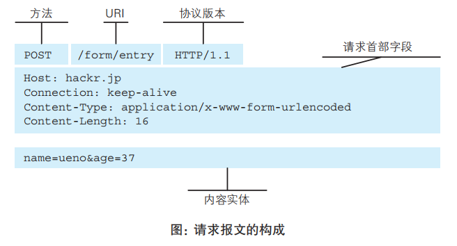
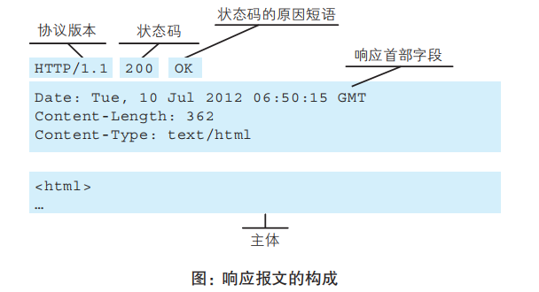
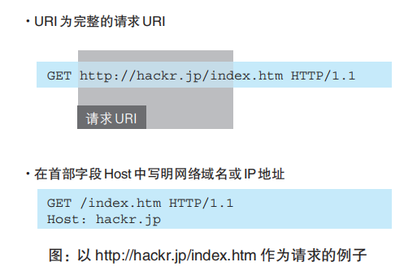
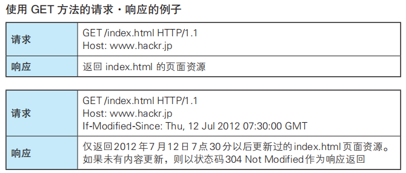
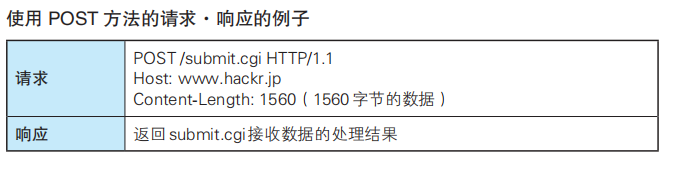
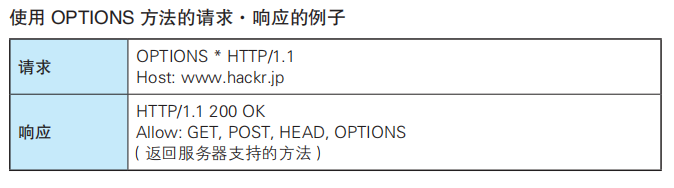
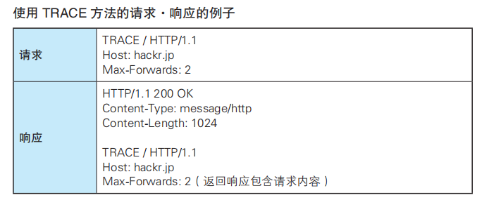
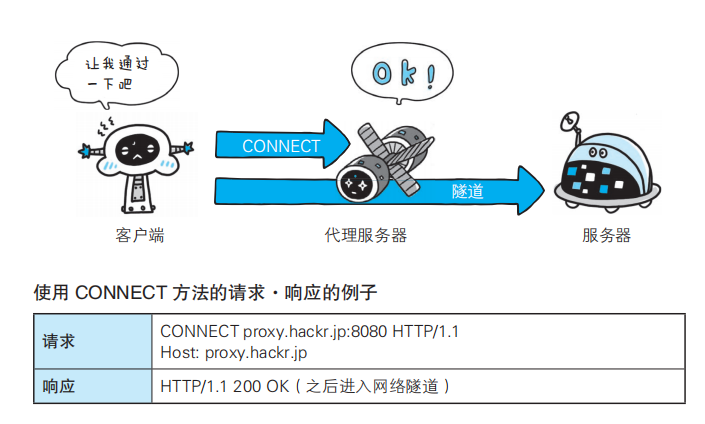
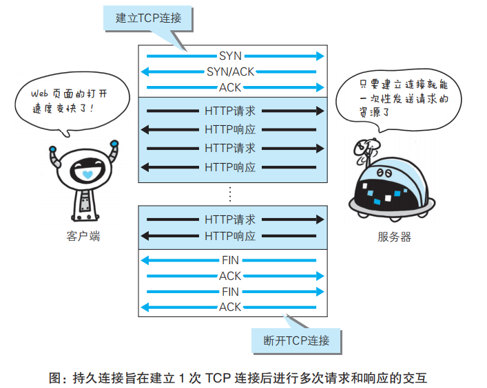
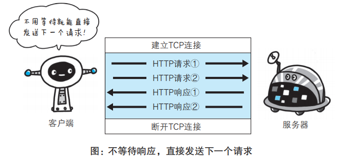

# HTTP协议简介
HTTP协议用于客户端和服务端之间的通信，通过请求和响应来完成通信。 

## 请求报文与响应报文格式
请求报文由：方法（method）、请求URI（request-URI）、协议版本、请求首部字段（可选）、内容实体（可选）组成。

如下图：

响应报文由：协议版本、状态码（status code）、状态码的原因短语（reason-phrase）、响应首部字段（可选）、资源实体的主体（可选）

如下图:

## HTTP是不保存状态的协议
即无状态协议（stateless）：自身不对请求和响应之间的通信状态进行保存。每当有新请求就会有对应新的响应产生，协议本身不会保留之前的请求/响应信息，这样是为了更快地处理大量事物，确保协议的可伸缩性。

优点：减少服务器的CPU及内存资源消耗

缺点：但有些业务是需要保存用户状态的，比如登录到某购物网站，即使跳转到该站其他页面，网站需要知道是谁发送出请求，即需要保持登录状态。于是引入了cookie。

## 请求URI
请求报文首部里面包含一个请求URI，用于定位资源

指定请求URI的方式有：
- URI为完整URI
- 在首部字段中Host中指定域名或者IP地址
- 如果不是访问特定资源，而是对服务器本身发起请求，可以用 * 代替请求URI

比如下图： 

## HTTP方法
HTTP/1.1中可使用的方法：

#### GET：获取资源
请求访问已被 URI 识别的资源

例子如图： 

#### POST: 传输实体主体
例子如图： 

#### PUT: 传输文件
用来传输文件，在请求报文的主体中包含文件内容，然后保存到请求URI指定的位置。
但是PUT方法不存在验证机制，任何人都可以上传，存在安全问题，一般web网站不使用。

#### HEAD: 获取报文首部
和GET方法类似，只是不返回报文主体内容。用于确认URI的有效性、资源更新的日期等等

#### DELETE：删除文件
DELETE 方法按请求 URI 删除指定的资源，同样不带验证机制

#### OPTIONS: 查询支持的方法
查询针对请求URI指定的资源支持的方法

例子如图： 

#### TRACE: 追踪路径
让web服务器将之前的请求通信环回给客户端。可以查询发送出去的请求是怎样被加工修改/篡改的，因为想要连接到目标服务器可能会通过代理中转，TRACE方法用来确认这一连接过程发生的一系列操作。

发送请求时，在Max-Forwards首部字段填入数值，经过一个服务器端就减1，最后为0时停止传输，最后接收到请求的服务器端 返回状态码200的响应

例子如图： 

#### CONNECT：要求用隧道协议连接代理
在与代理服务器通信时建立隧道，实现用隧道协议进行TCP通信。主要使用 SSL（Secure Sockets Layer，安全套接层）和 TLS（Transport Layer Security，传输层安全）协议把通信内容加密后经网络隧道传输。

（ps：之后会讲到隧道）

例子如图： 

## 持久连接节省通信量
HTTP初始版本中每进行一次 HTTP通信 就要断开一次 TCP连接。当进行小容量文件传输时没多大问题，但是随着HTTP的普及，文档中可能包含大量图片。

使用浏览器访问一个包含多张图片的HTML页面时，在发送请求访问HTML页面资源时，也会发送请求HTML页面里包含的其他资源。每次请求都会造成TCP连接建立和断开，增加通信开销量。

于是HTTP/1.1和一部分HTTP/1.0提出了解决方法：
- 持久连接（HTTP Persistent Connections，也称为 HTTP keep-alive 或HTTP connection reuse）
- 管线化（pipelining）

#### 持久连接
特点是只要任意一端没有明确提出断开连接，则保持TCP连接状态，即一次TCP连接后进行多次请求和响应的交互。这样可以减少重复TCP连接断开的开销，减轻服务器端负载。而减少开销的时间令web页面更快显示。

如图所示： 

客户端和服务器发现对方一段时间没有活动，就可以主动关闭连接。不过，规范的做法是，客户端在最后一个请求时，发送Connection: close，明确要求服务器关闭TCP连接。(http://www.ruanyifeng.com/blog/2016/08/http.html)

#### 管线化
管线化在持久连接的基础上，使得不用等待响应就可以发送下一个请求。同样可以提高请求速度。

如图所示： 

