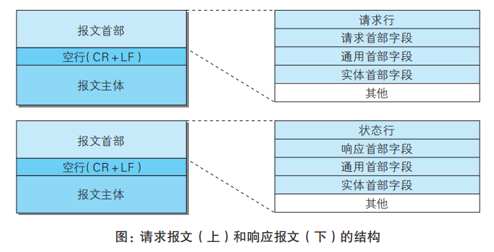
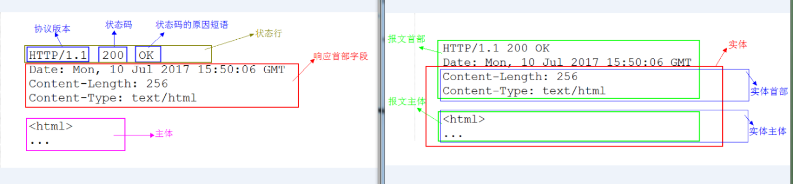
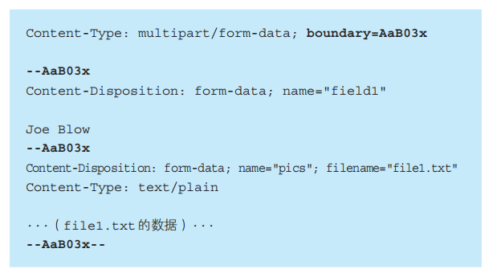
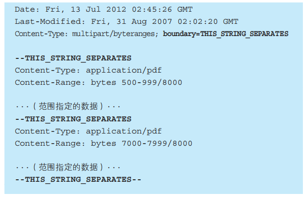
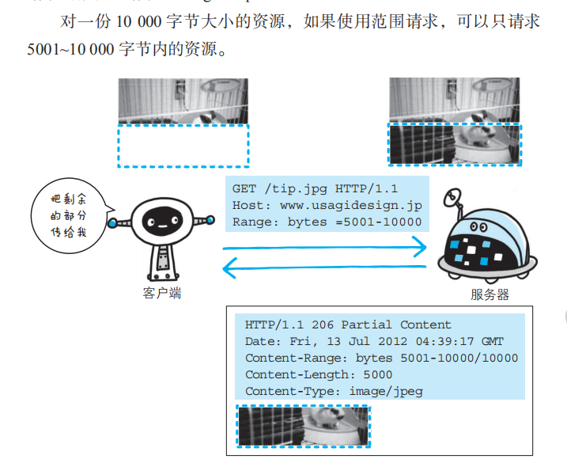

# HTTP报文

### 报文结构
报文由报文首部、报文首部与报文主体之间的空行、报文主体组成。

具体结构如图所示：<br>


请求行即方法、请求URI、协议版本，状态行即协议版本、状态码、原因短语。
其他首部字段之后介绍


### 通过编码提升速率
HTTP在传输数据时可以按照数据原貌直接传输，也可以在传输过程中通过编码提升速度。

提升速率的方法：

- （压缩传输的）内容编码
指明应用在实体内容上的编码格式，并保持实体信息原样压缩。内容编码后的实体由客户端接收并负责解码
- （分割发送的）分块传输编码
在传输大容量数据时，通过把数据分割成多块，能够让浏览器逐步显示页面。分块传输编码把 实体主体 分成多个块，同样由客户端接收来解码、复原


### 实体主体与报文主体
上面说到了实体主体，那么什么是实体？实体和报文的区别？

首先了解报文和实体的区别：
- 报文（message）
是HTTP通信中的基本单位，通过HTTP通信传输。报文主体是空行下面的部分且是可选的，get请求就没有报文主体。
- 实体（entity）
实体其实是报文的一部分，存在于报文主体内。作为请求或响应的有效载荷数据被传输，其内容由实体首部和实体主体组成。

上面说报文是HTTP通信中的基本单位，意思是：在应用层看来，一次传输中报文就是一个传输的单位。

实体是有效载荷数据，分为实体主体和实体头部，实体头部/主体都不一定会存在。比如只有实体主体而不存在实体首部。

下图展示主体、实体关系：<br>


通常实体主体=报文主体，只有在传输时进行编码操作时，实体主体会发生变化。
需要实体头部的场合，则是“传输时进行编码操作”时，如下面传输表单内容（下面有多个实体）：
```
POST /upload HTTP/1.1
Host: example.com
Content-Length: xxx
Content-Type: multipart/form-data; boundary=AaBbCcDd

--AaBbCcDd
Content-Disposition: form-data; name="username" //实体头部

RuphiLau  //实体主体
--AaBbCcDd
Content-Disposition: form-data; name="file"; filename="picture.jpg"
Content-Type: image/jpeg

...(picture.jpg的数据)...
--AaBbCcDd--

```

（上面内容参考https://www.zhihu.com/question/263752229）


### 多部分对象集合（发送多种数据）
发送的报文里面可以包含多类型实体。通常是在图片或文本文件等上传时使用。包含的对象有（在Content-Type里指明）：

- multipart/form-data
web表单上传文件时使用，如下图：<br>


- multipart/byteranges
状态码 206（Partial Content，部分内容）响应报文包含了多个范围的内容时使用，如下图：<br>




### 范围请求（获取部分内容）
范围请求可以恢复之前中断的下载，需要指定下载的实体范围。<br>


注意到响应状态码是206。如果服务器端无法响应范围请求，则会返回状态码 200 OK 和完整的实体内容。


### 内容协商（返回最合适的内容）
同一个网站可能有多份相同内容的页面（比如一个网站的英文版和中文版），当浏览器默认语言为中文时，访问相同URI的web页面，返回对应语言版本的页面，这样的机制称为内容协商（Content Negotiation）。
内容协商指客户端、服务器端对响应内容进行交涉，提供给客户端最合适的资源。请求报文中某些字段就是协商的基准：
- Accept
- Accept-Charset
- Accept-Encodeing
- Accept-Language
- Content-Language
