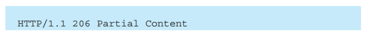

# HTTP报文

### 报文结构
报文由报文首部、报文首部与报文主体之间的空行、报文主体组成。

具体结构如图所示：<br>


请求行即方法、请求URI、协议版本，状态行即协议版本、状态码、原因短语。
其他首部字段之后介绍


### 通过编码提升速率
HTTP在传输数据时可以按照数据原貌直接传输，也可以在传输过程中通过编码提升速度。

提升速率的方法：

- （压缩传输的）内容编码
指明应用在实体内容上的编码格式，并保持实体信息原样压缩。内容编码后的实体由客户端接收并负责解码
- （分割发送的）分块传输编码
在传输大容量数据时，通过把数据分割成多块，能够让浏览器逐步显示页面。分块传输编码把 实体主体 分成多个块，同样由客户端接收来解码、复原


### 实体主体与报文主体
上面说到了实体主体，那么什么是实体？实体和报文的区别？

首先了解报文和实体的区别：
- 报文（message）
是HTTP通信中的基本单位，通过HTTP通信传输。报文主体是空行下面的部分且是可选的，get请求就没有报文主体。
- 实体（entity）
实体其实是报文的一部分，存在于报文主体内。作为请求或响应的有效载荷数据被传输，其内容由实体首部和实体主体组成。

上面说报文是HTTP通信中的基本单位，意思是：在应用层看来，一次传输中报文就是一个传输的单位。

实体是有效载荷数据，分为实体主体和实体头部，实体头部/主体都不一定会存在。比如只有实体主体而不存在实体首部。

下图展示主体、实体关系：<br>


通常实体主体=报文主体，只有在传输时进行编码操作时，实体主体会发生变化。
需要实体头部的场合，则是“传输时进行编码操作”时，如下面传输表单内容（下面有多个实体）：
```
POST /upload HTTP/1.1
Host: example.com
Content-Length: xxx
Content-Type: multipart/form-data; boundary=AaBbCcDd

--AaBbCcDd
Content-Disposition: form-data; name="username" //实体头部

RuphiLau  //实体主体
--AaBbCcDd
Content-Disposition: form-data; name="file"; filename="picture.jpg"
Content-Type: image/jpeg

...(picture.jpg的数据)...
--AaBbCcDd--

```

（上面内容参考https://www.zhihu.com/question/263752229）


### 多部分对象集合（发送多种数据）
发送的报文里面可以包含多类型实体。通常是在图片或文本文件等上传时使用。包含的对象有（在Content-Type里指明）：

- multipart/form-data
web表单上传文件时使用，如下图：<br>


- multipart/byteranges
状态码 206（Partial Content，部分内容）响应报文包含了多个范围的内容时使用，如下图：<br>



### 范围请求（获取部分内容）
范围请求可以恢复之前中断的下载，需要指定下载的实体范围。<br>


注意到响应状态码是206。如果服务器端无法响应范围请求，则会返回状态码 200 OK 和完整的实体内容。


### 内容协商（返回最合适的内容）
同一个网站可能有多份相同内容的页面（比如一个网站的英文版和中文版），当浏览器默认语言为中文时，访问相同URI的web页面，返回对应语言版本的页面，这样的机制称为内容协商（Content Negotiation）。
内容协商指客户端、服务器端对响应内容进行交涉，提供给客户端最合适的资源。请求报文中某些字段就是协商的基准：
- Accept
- Accept-Charset
- Accept-Encodeing
- Accept-Language
- Content-Language


### 状态码
1. 状态码作用：
让客户端知道服务器端的处理结果，是正常处理了请求还是出现错误。

2. 状态码类别：
- 1xx：Informational（信息性状态码）
  接收的请求正在处理

- 2xx：Success（成功状态码）
  请求正常处理完毕

- 3xx：Redirection（重定向状态码）
  需要进行附加操作以完成请求

- 4xx：Client Error（客户端错误状态码）
  服务器无法处理请求

- 5xx：Server Error（服务端错误状态码）
  服务器处理请求出错


3. 常见的状态码：
- 2xx 成功状态码
  - 200 OK
    请求被正常处理

  - 204 No Content
    请求已成功处理，但返回的响应报文中不包含实体的主体部分

  - 206 Partical Content
    客户端进行了范围请求，服务器成功执行了这部分的GET请求


- 3xx 重定向状态码
  - 301 Moved Permanently
    永久性重定向。表示请求的资源已经分配到新的URI，以后应使用现在资源所指的URI。

  - 302 Found
    临时性重定向。请求的资源已被分配了新的 URI，希望用户（本次）能使用新的 URI 访问。

  - 303 See Other
    请求对应的资源存在着另一个 URI，应使用 GET方法定向获取请求的资源。303 状态码明确表示客户端应当采用 GET 方法获取资源，这点与 302 状态码有区别。

  - 304 Not Modified
    （和重定向没关系但被分配到这里）服务端资源未发生改变，可直接使用客户端未过期的缓存。响应不包含主体

  - 307 Temporary Redirect
    临时重定向。和302的区别：302标准禁止将POST改成GET，但实际大家没有遵守。307会遵照浏览器标准，不会变成GET


  ps：当 301、302、303 响应状态码返回时，几乎所有的浏览器都会把POST 改成 GET，并删除请求报文内的主体，之后请求会自动再次发送。301、302 标准是禁止将 POST 方法改变成 GET 方法的，但实际使用时大家都会这么做。


- 4xx 客户端错误
  - 400 Bad Requst
    请求报文中存在语法错误

  - 401 Unauthorized
    表示发送的请求需要有 通过HTTP认证 的认证信息。若之前已经进行过一次请求，则表示用户认证失败<br>
    

  - 403 Forbidden
    请求的资源被服务器端拒绝。

  - 404 Not Found
    服务器上无法找到请求的资源

  - 405 Method Not Allowed
    方法不被允许。GET 与 HEAD 两个方法不得被禁止，不会返回状态码 405

  - 417 Expectation Failed
    服务器无法满足 Expect 请求消息头中的期望条件

  - 412 Precondition Failed
    条件请求不满足时会返回。比如请求报文里的If-Match字段与Etag字段无法匹配，服务端返回412


- 5xx 服务端错误
  - 500 Internal Server Error
    服务器在执行请求时发送错误、服务器遇到了不知道如何处理的情况

  - 503 Service Unavailable
    服务器暂时处于超负荷状态 或 正在进行停机维护，现在无法处理请求

  - 504 Gateway Time-out
    网关超时


### 与HTTP协作的web服务器
1. 虚拟主机（实现多个域名）
HTTP/1.1 协议允许一台HTTP服务器搭建多个web站点，这是利用了虚拟主机的功能。
客户端访问网站时，会用域名+主机的方式，经过DNS解析后，变成了IP地址。位于同一个服务器上的站点IP地址相同，因此在发送HTTP请求时，必须在Host首部完整指定主机名或域名的URI。

2. 通信数据转发程序（代理、网关、隧道）
这些应用程序和服务器能将 请求 转发给通信线路的下一站服务器，并且能将 响应 再转发给客户端。

  - 代理
    是一种有转发功能的应用程序，基本行为是转发请求和响应，并且转发时附加Via首部字段（标记出经过的主机信息）<br>
    
    代理可以按 是否使用缓存 和是否修改报文 分类：
      - 缓存代理会将资源副本保存在代理服务器上，当再次接收到对相同资源的请求时，就不用从源服务器获取资源了（会验证资源的有效性）
      - 透明代理不对报文做任何加工。反之，对报文进行加工的代理是非透明代理

    为什么要使用代理？
      - 利用 缓存技术 减少网络带宽的流量（提高访问速度；客户端可就近从缓存服务器上获取资源）
      - 组织内部针对特定网站的访问控制（可以设置IP地址过滤；对于使用代理的局域网来说，外部看来只有代理服务器可见，起到防火墙作用）
      - 方便管理用户（可以对用户的访问时间、地点、信息流量进行统计）
  - 网关
    网关和代理类似，但是网关能使通信线路上的服务器提供 非HTTP协议服务。
    为什么使用网关:
    提高安全性。因为可以在客户端与网关之间的通信线路上加密，以确保连接的安全性
  - 隧道
    隧道是在相隔甚远的客户端和服务器两者之间进行中转，并保持双方通信连接的应用程序（会使用SSL等加密手段）。
    作用：本身不解析HTTP请求，目的是确保客户端与服务器安全通信

3. 保存资源的缓存（服务器缓存/客户端缓存）
缓存代理可以减少对源服务器的访问，节省通信流量和通信时间。但是缓存的资源存在有效性（比如缓存的有效期），会向源服务器确认资源。
除了可以在服务器端缓存资源，还可以在客户端缓存资源，在缓存有效期内可以直接从本地磁盘读取。