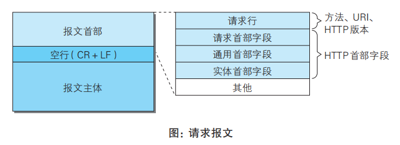
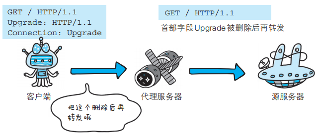
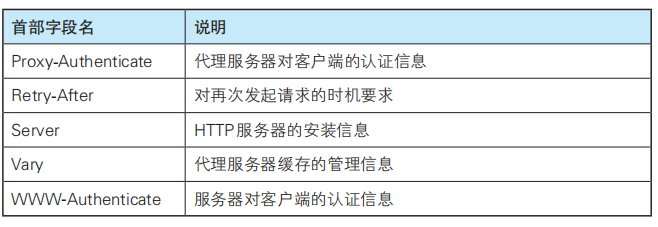

# HTTP报文首部

### 首部结构
HTTP首部存放的是客户端和服务端分别处理请求/响应需要的信息，主体存放的是用户和资源的信息。
使用首部字段是为了给浏览器、服务器提供报文主体大小、所使用的语言、认证信息等内容。

请求报文首部结构：
可以分为请求行和首部字段。请求行即请求方法、URI、HTTP版本；首部字段可以分为请求首部字段、通用首部字段、实体首部字段。<br>



响应报文首部结构：
可以分为状态行和首部字段。状态行即HTTP版本、状态码；首部字段可以分为响应首部字段、通用首部字段、实体首部字段。<br>


### 通用首部字段
通用首部是请求报文和响应报文都会用到的，主要有如下字段：
  - Cache-Control：控制缓存的行为
  - Connection：逐跳首部、连接的管理
  - Date：创建报文的日期
  - Pragma：报文指令
  - Trailer：报文末端的首部一览
  - Transfer-Encoding：指定报文主体的传输编码方式
  - Upgrade：升级为其他协议
  - Via：代理服务器的相关信息
  - Warning：错误通知

#### 1. Cache-Control：操作缓存
  ##### 1.1 分类
  Cache-Control指令可以按请求和响应分类。

  请求：<br>
  
  

  响应：<br>
  


  ##### 1.2 表示是否能缓存的指令

  public指令（响应指令）：明确表示其他用户都可以利用缓存

  private指令（响应指令）：缓存服务器只对特定用户提供资源缓存的服务，对于其他用户发送过来的请求，代理服务器不会返回缓存

  no-cache指令：使用 no-cache 指令的目的是为了防止从缓存中返回过期的资源。对于请求来说，是指不要缓存的资源，代理服务器会向源服务器请求新资源。对于响应来说，那么缓存服务器不能对资源进行缓存，避免缓存被使用，保证每次的资源都是最新的。


  ##### 1.3 控制 可执行缓存的对象 的指令

  no-store：暗示请求（和对应的响应）或响应中包含机密信息。规定缓存不能在本地储存请求或响应的任一部分

  no-store和no-cache区别：no-cache代表不缓存过期的资源，缓存会向源服务器进行有效期确认后处理资源。no-store才是真正地不进行缓存

  ##### 1.4 指定缓存期限和认证的指令

  max-age：对于客户端来说，如果缓存期没过就接收缓存的资源，如果过了缓存服务器将请求转发给源服务器。对于源服务器来说，在有效期内，缓存服务器不必向源服务器确认资源。如果同时存在Expires首部字段，会优先处理max-age

  s-maxage：与max-age差不多。区别是s-maxage只适用于供多位用户使用的公共缓存服务器（代理），当使用 s-maxage 指令后，则直接忽略对 Expires 首部字段及max-age 指令的处理

  no-transform：代理不可更改实体主体的媒体类型，可以防止代理/缓存 压缩图片等类似操作

  min-fresh（请求指令）：要求缓存服务器返回 在指定时间内还未过期 的缓存资源

  max-stale（请求指令）：处于这个时间内，资源哪怕过期了客户端也会接收

  only-if-cached（请求指令）：从缓存获取资源，不确认有效性

  must-revalidated（响应指令）：缓存服务器可以缓存，但是要向源服务器确认是否有效。如果代理无法连通源服务器再次获取有效资源，则返回504（Gateway Timeout）状态码。且会忽略请求的max-stale指令

  proxy-revalidated（响应指令）：要求缓存服务器在返回响应前，必须再确认缓存有效性


  ##### 1.5 Cache-Control扩展

  cache-extension token：
  例子：比如下面的community="UCI"，extension tokens 仅对能理解它的缓存服务器来说是有意义的
  ```
  Cache-Control: private, community="UCI"
  ```


#### 2. Connection
  Connection字段有两个作用：
  ##### 2.1 控制不再转发给代理的首部字段
  

  ##### 2.2 管理持久连接
  HTTP/1.1默认连接都是持久连接，客户端会在持久连接上连续发送请求，当服务器明确想断开连接时，则指定Connection字段为close

#### 3. Date
  表明创建报文的日期和时间

#### 4. Pragma
  是为了兼容HTTP/1.1以前的版本，规范定义的形式唯一：

#### 5. Trailer
  表示在报文主体后有哪些首部字段

#### 6. Transfer-Encoding
  规定了传输报文主体时采用的编码方式(编码方式有内容编码和分块传输编码). HTTP/1.1 的传输编码方式仅对分块传输编码有效:
  ```
  HTTP/1.1 200 OK
  Date: Tue, 03 Jul 2012 04:40:56 GMT
  Cache-Control: public, max-age=604800
  Content-Type: text/javascript; charset=utf-8
  Expires: Tue, 10 Jul 2012 04:40:56 GMT
  X-Frame-Options: DENY
  X-XSS-Protection: 1; mode=block
  Content-Encoding: gzip
  Transfer-Encoding: chunked  /-------------------------
  Connection: keep-alive 

  cf0　　←16进制(10进制为3312)

  ...3312字节分块数据...

  392　　←16进制(10进制为914)

  ...914字节分块数据...

  0
  ```
  正如在首部字段 Transfer-Encoding 中指定的那样，有效使用分块传输编码，且分别被分成 3312 字节和 914 字节大小的分块数据

#### 7. Upgrade
  检测 HTTP 协议及其他协议是否可使用更高的版本进行通信。
  Upgrade 首部字段产生作用的 Upgrade 对象仅限于客户端和邻接服务器，因此使用Upgrade时还要指定Connection：Upgrade<br>
  

#### 8. Via
  追踪客户端与服务器之间的 请求和响应报文 的传输路径。报文经过代理/网关时，会在Via首部添加该服务器信息才转发。

#### 9. Warning
  该首部通常会告知用户一些与缓存相关的问题的警告（如响应已过期、再验证失败等等）


### 请求首部字段
请求首部用于补充请求的附加信息、客户端信息、对响应内容的优先级等。请求首部一览表：<br>


#### 1. Accept
  通知服务器，用户代理（User Agent，用户代理并不是仅指浏览器，还包括搜索引擎。它是由浏览器和搜索引擎及其所处硬件平台、系统软件、应用软件等所组成的一个用户环境。用户代理字段，被广泛用来标识浏览器客户端信息）能够处理的媒体类型及媒体类型的优先处理级。形如type/subtype，逗号隔开各个类型：
  ```
  Accept: text/html,application/xhtml+xml,application/xml;q=0.9,*/*;q=0.8
  ```

  q为优先级，最大为1.0（默认）

  媒体类型例子：
  - 文本文件
  text/html, text/plain, text/css ...
  application/xhtml+xml, application/xml ...
  - 图片文件
  image/jpeg, image/gif, image/png ...
  - 视频文件
  video/mpeg, video/quicktime ...
  - 应用程序使用的二进制文件
  application/octet-stream, application/zip ...

#### 2. Accept-Charset
  通知服务器，用户代理支持的字符集及字符集的相对优先顺序

#### 3. Accept-Encoding
  告知服务器，用户代理支持的内容编码及内容编码的优先级顺序。内容编码例子有gzip、compress等

#### 4. Accept-language
  告知服务器，用户代理能够处理的然语言集（指中文或英文等），以及自然语言集的相对优先级
  ```
  Accept-Language: zh-cn,zh;q=0.7,en-us,en;q=0.3
  ```

#### 5. Authorization
  告知服务器，用户代理的认证信息（证书值）。

  在接收到需要HTTP认证信息的401响应码后，用户代理会把Authorization字段加入请求：<br>
  

#### 6. Expect
  告知服务器期望出现的某种特定行为。当服务器无法理解时，会返回状态码417 Expectation Failed。

#### 7. From
  告知服务器，使用用户代理的用户的电子邮件地址。目的就是为了显示搜索引擎等用户代理的负责人的电子邮件联系方式

#### 8. Host
  告知服务器，请求的资源所处的互联网主机名和端口号，必须包含在请求内。因为很多虚拟主机可以运行在同一个IP上，用Host来区分

#### 9. If-Match、If-None-Match、If-Modified-Since、If-Unmodified-Since、If-Range
  形如If-xxx的为条件请求，当服务器判定条件成立时，才会执行请求.

  If-Match：

  告知服务器匹配资源所用的实体标记值。实体标记（ETag）是与特定资源关联的确定值。资源更新后ETag也会随之更新。只有当 If-Match 的字段值跟 ETag 值匹配一致时，服务器才会接受请求 ，反之返回412 Precondition Failed 。当指定值为*时，服务器忽略ETag值，只有资源存在就处理。


  If-None-Match：

  与If-Match相反，当与Etag字段值不一样时可处理请求。


  If-Modified-Since：

  在If-Modified-Since指定的日期之后，资源发生了更新，服务器就接受请求，反之返回304 Not Modifined


  If-Unmodified-Since：

  与上面相反，在指定日期之后，如果资源没有更新，则服务器处理请求。否则返回412 Precondition Failed


  If-Range：

  如果If-Range值与Etag值，或者更新日期时间，匹配一致时请求处理。反之返回全体资源。

  如果不使用If-Range，就请求部分资源（使用Range），如果资源更新了，那么部分请求则无效，这时服务器返回412 Precondition Failed。其目的是催促客户端再次发送请求，这样就请求了两次。

#### 10. Max-Forwards
  指定可经过的服务器的最大数目。每经过一个代理服务器，就会将Max-Forwards减少1，为0时不再转发而是返回响应。

  使用HTTP协议通信时，请求可能会经过多个代理，当某个代理发生转发错误时，客户端就无法收到响应。而指定了Max-Forwadrs，至少可以知道，到值为0的那台服务器的路径的通信状况。

#### 11. Proxy-Authorization
  当接收到代理服务器发来的认证质询时，客户端就会发送包含Proxy-Authorization字段的请求。

  这个与Authorization类似，不同之处在于认证行为发生于客户端和代理之间。

#### 12. Range
  请求指定范围的部分资源。服务器会返回206 Partical Content响应，如果无法处理该范围请求，则返回200 OK的响应及全部资源。

#### 13. Referer
  【其实Referer正确写法为Referrer】

  告知服务器请求的原始资源的URI。因为URI查询字段可能含有保密信息，要考虑安全性.<br>
  

#### 14. TE
  会告知服务器客户端能够处理响应的传输编码方式及相对优先级。
  ```
  TE: gzip, deflate;q=0.5
  ```
  注意与Accept-Encoding的区别：
  - Accept-Encoding：内容编码方式
  - TE：传输编码方式。还可以指定分块传输编码方式：TE: trailers

#### 15. User-Agent
  将浏览器和用户代理名称等信息传达给服务器。

  如果由网络爬虫发起请求，可能会添加爬虫作者的电子邮箱地址；如果经过代理，可能会添加上代理服务器的名称。  


### 响应首部
用于补充响应的附加信息、服务器信息，以及对客户端的附加要求等<br>



#### 1. Accept-Ranges
  告知客户端，服务端能否处理范围请求。可以处理时指定：Accept-Ranges：bytes，反之Accept-Ranges：none

#### 2. Age
  告知客户端，源服务器在多久前（单位为秒）创建了响应。

  如果返回响应的是缓存服务器，Age值指的是缓存后，响应再次发起认证到认证完成的时间值
  

#### 3. ETag（Entity Tag）
  服务器会为每份资源分配唯一性标识，即ETag值，资源更新时，ETag值也会更新。

  请求响应中的If-Match/If-None-Match，If-Range与Etag值有关。

  ETag有强Etag和弱ETag之分：
  - 强ETag：
    无论实体发生多么细微的变化都会改变其值
  - 弱ETag：
    只用于提示资源是否相同。只有发生根本性改变才改变ETag值（只要资源语义上相等则不算改变），会在字段值最开始附加W/

#### 4. Location
  当请求的资源被移动到其他地方，服务器返回3xx ：Redirection 的响应，提供重定向的URI。
  ```
  302 Found
  Location：http：//xxxx
  ```
  引导客户端到某个与请求URI位置不同的资源

#### 5. Proxy-Authenticate
  会把由代理服务器所要求的认证信息发送给客户端

#### 6. WWW-Authenticate
  用于客户端和服务端之间的HTTP访问认证，告知客户端适用于访问请求 URI 所指定资源的认证方案（Basic 或是 Digest）和带参数提示的质询（challenge）。 401 Unauthorized 响应中，肯定带有 WWW-Authenticate。

#### 7. Retry-After
  告知客户端多久之后再发送请求。主要配合状态码 503 Service Unavailable 响应，或 3xx Redirect 响应一起使用。

#### 8. Server
  告知客户端，当前服务器上安装的HTTP服务器应用程序的信息。

  不单单会标出服务器上的软件应用名称，还有可能包括版本号和安装时启用的可选项。
  ```
  Server: Apache/2.2.6 (Unix) PHP/5.2.5
  ```

#### 9. Vary
  对缓存进行控制。源服务器向代理服务器传达 关于本地缓存的使用方法 的命令。

  比如：

  1.客户端发送Accept-Language：en-us的请求

  2.代理服务器转发给源服务器

  3.代理服务器接受到源服务器返回的包含Vary（Vary为：Accept-Language）的响应后，将响应转给客户端

  4.若要再进行缓存（即再有请求过来），仅对请求中含有相同Vary指定字段的请求返回缓存（即请求还是Accept-Language：en-us。）反之从源服务器获取资源再返回。


### 实体首部
用于补充内容的更新时间等 与实体相关的信息<br>


#### 1. Allow
  通知客户端能够支持 Request-URI 指定资源的所有 HTTP 方法。

  当服务器接收到不支持的HTTP方法时，返回405 Method Not Allowed,与此同时将支持的方法写入Allow

#### 2. Content-Encoding
  告知客户端，服务器对实体主体部分选用的内容编码方式

#### 3. Content-Language
  告知客户端，实体主体使用的自然语言（指中文或英文等语言）

#### 4. Content-Length
  表明实体主体的大小（字节）

#### 5. Content-Location
  给出与报文主体部分相对应的 URI。

  与响应首部Location的区别：

  Location是指资源被移动到其他地方，服务器用Location指示资源新位置。

  Content-Location是指示用于访问资源的直接URI。

  例子：（ https://cloud.tencent.com/developer/section/1189923 ）<br>
  
  

#### 6. Content-MD5
  其值是一串由MD5算法生成的值，目的在于检查报文在传输过程中是否保持完整，以及确认传输到达。

  客户端会对接收到的报文执行相同的MD5算法，与Content-MD5字段值比较，即可判断报文主体的准确性

#### 7. Content-Range
  表示实体主体的位置范围

  针对范围请求时，返回的响应会使用Content-Range，告诉客户端：作为响应返回的实体，哪个部分符合范围请求

#### 8. Content-Type
  实体主体的媒体类型

#### 9. Expires
  实体主体失效日期

  在有效期内，缓存服务器会以缓存来应答请求。

  当首部字段 Cache-Control 有指定 max-age 指令时，比起首部字段 Expires，会优先处理 max-age 指令

#### 10. Last-Modified
  指明资源最近一次修改的时间


### 为Cookie服务的首部字段
Cookie的工作机制是用户识别和状态管理。web网站为了管理用户状态，会通过浏览器把数据临时写入用户计算机。当用户再访问web网站时，可以通过通信方式取回之前存放的cookie
cookie首部字段：
- Set-Cookie：属于响应首部字段。开始状态管理使用的Cookie信息
- Cookie：请求首部字段。将cookie信息发送给服务器

#### 1. Set-Cookie
  当服务器准备开始管理客户端的状态时，会事先告知各种信息
  比如
  ```
  Set-Cookie: status=enable; expires=Tue, 05 Jul 2011 07:26:31 GMT; path=/; domain=.hackr.jp;
  ```

  字段属性一览表：<br>
  
  

  ##### expires属性

  指定cookie有效期。不指定时cookie在关闭浏览器后失效

  另外，一旦cookie从服务器发送给客户端，客户端就不能显示地删除cookie，只能通过修改expires使其过期才删除（或者令Max-age为0）


  ##### path属性

  url 路径前缀，该路径下的页面可以访问该 cookie。

  比如设置成'/xx',    那么cookie在'/xx/123'和'/xx'下都可见

  通常置为根目录：path=/，以使 cookie 对此网站的所有页面可见


  ##### domian属性

  可访问 cookie 的域，比如domain=site.com。

  默认不设置domain的情况下，在site.com设置的cookie只能在site.com获取，在xx.site.com也是无法访问的，如果想要设置为可访问，可以设置    domain = site.com    ，这样使 cookie 可以被在任何子域 *.site.com 访问


  ##### Secure、HttpOnly属性
  默认情况下，cookie基于域的，不区分协议，故http/https协议下都可以获取cookie。
  如果一个 cookie 包含绝不应该通过未加密的 HTTP 协议发送的敏感内容，那么就应该设置这个选项：
  ```
  // 假设我们现在在 HTTPS 环境下
  // 设置 cookie secure（只在 HTTPS 环境下可访问）
  document.cookie = "user=John; Secure;";
  ```
  如果设置了HttpOnly，则document.cookie访问不到cookie（禁止任何 JavaScript 访问 cookie）【避免跨域脚本 (XSS) 攻击】
  在服务端设置：
  ```
  Set-Cookie: id=a3fWa; Expires=Wed, 21 Oct 2015 07:28:00 GMT; Secure; HttpOnly
  ```


  ##### samesite属性

  samesite允许服务器要求某个cookie在跨站请求时不会被发送，作用是防止CSRF (XSRF) 攻击

  有三种值：

  None：

  浏览器会在同站请求、跨站请求下继续发送cookies，不区分大小写

  Strict

  只在访问相同站点时发送cookie

  Lax（新版本浏览器中为默认）

  和 strict 模式类似，当从外部来到网站，则禁止浏览器发送 cookie，但是增加了一个例外。

  如果以下两个条件均成立，则会发送 samesite=lax cookie：
  - HTTP 方法是“安全的”（例如 GET 方法，而不是 POST）。
  - 该操作执行顶级导航（更改浏览器地址栏中的 URL）
    如果导航是在一个 iframe中执行的，那么它就不是顶级的


#### 2. cookie
  通过在请求中包含从服务器接收的cookie信息，获得HTTP状态管理支持

  接收到多个Cookie时，同样可以以多个cookie形式发送


### 其他首部字段
在HTTP等多种协议中，通过给非标准参数前加X-前缀，来与标准参数区分。但是这种做法百害无一利，已建议停止该做法。对于已经使用X-前缀的参数则不要求更改

#### 1. X-Frame-Options（属于响应首部）
  用于控制网站内容在其他Web网站的Frame标签内的显示问题

  目的是为了防止点击劫持攻击（clickjacking）（利用iframe标签的透明属性，将透明页面置于原网页上面，在用户不小心点击时进行一些操作）
  
  X-Frame-Options可指定的字段值：
  - NENY：
  该页面不允许在frame中显示
  - SAMEORIGIN：
  该页面可以在相同域名页面的iframe中显示

#### 2. X-XSS-Protection（属于响应首部）
  针对跨站脚本攻击（XSS）的一种对策，用于控制浏览器 XSS 防护机制的开关
  - 0 ：将 XSS 过滤设置成无效状态
  - 1 ：将 XSS 过滤设置成有效状态

#### 3. DNT（属于请求首部）
  （Do Not Track）意为拒绝个人信息被收集，是表示拒绝被精准广告追踪的一种方法
  - 0 ：同意被追踪
  - 1 ：拒绝被追踪