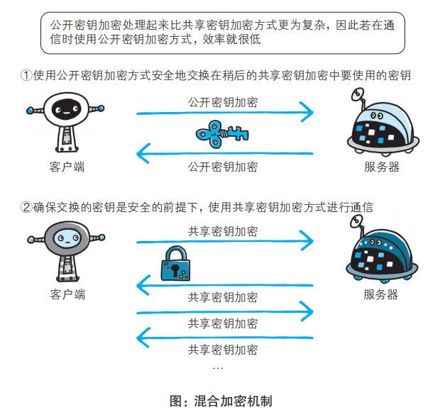
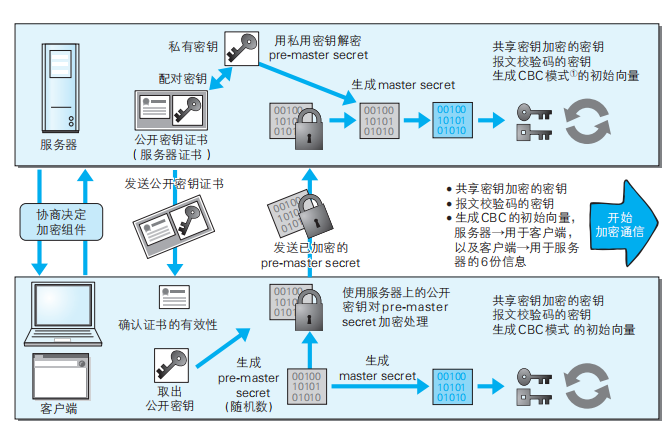

# HTTPS

### HTTP的缺点
#### 1. 通信使用明文，可能被窃听
  HTTP本身不具备加密功能，所以无法做到对通信整体（使用HTTP协议通信的请求和响应内容）进行加密。

  防止信息被窃听的方法：

  1）通信加密：

  建立起安全的通信线路。HTTP 协议中没有加密机制，但可以通过和 SSL（Secure Socket Layer，安全套接层）或 TLS（Transport Layer Security，安全传输层协议）的组合使用，加密 HTTP 的通信内容。与SSL一起使用的HTTP称为HTTPS（HTTP Secure 超文本传输安全协议）

  2）内容加密：

  客户端和服务端都需要具备加密和解密的机制。但是仍有被篡改的风险

#### 2. 不验证通信方的身份，可能遭遇伪装
  请求和响应不对对通信方进行确认：
  - 无法确认客户端/服务器是否是按真实意图接收/返回响应的客户端/服务器；
  - 无法确定正在通信的对方是否具备访问权限。因为某些服务器上保持重要信息只想给特定用户通信权限；
  - 无法判定请求来自何方出自谁手；
  - 对于无意义请求服务器都照单全收，无法阻止大量请求下的DoS攻击（Denial of Service，拒绝服务攻击）

  确认身份方法：

  SSL不仅可以对通信加密，还可以确定通信方（通过一种称为证书的手段）。证书由值得信任的第三方机构颁发，用以证明服务器和客户端是实际存在的。

#### 3. 无法证明报文的完整性，可能被篡改
  所谓完整性即信息的准确度，http没有办法确认发出的请求/响应和接收到的请求/响应是一样的。

  遭攻击者拦截并篡改内容的攻击称为中间人攻击（Man-in-the-Middle attack，MITM）。

  如何防止篡改：

  虽然有使用HTTP协议确定报文完整性的方法，但并不可靠、便捷（MD5和SHA-1等散列值校验的方法【散列值是指作为哈希函数的答案给出的一段数据】，以及用来确认文件的数字签名方法）。需要操纵客户端的用户亲自检查验证下载文件是否是原来服务器上的文件，浏览器无法检查。而且MD5本身可能被改写.

  因此有必要使用HTTPS

### HTTPS = HTTP + 加密 + 认证 + 完整性保护
  HTTPS不是新协议，而是HTTP通信接口部分用SSL（Secure Socket Layer）和TLS（Transport Layer Security）协议代替。SSL技术在SSL3.0后，以SSL3.0为基准指定的TLS。

  通常HTTP直接和TCP通信，使用SSL则演变成 先和SSL通信，再由SSL和TCP通信。

  #### 加密解密技术
  SSL采用的是公开密钥加密的方法进行加密处理。加密方法一般有：
  - 共享密钥加密
  - 使用两把钥匙的公开密钥加密

  共享密钥加密： 
  也叫对称密钥加密，加密和解密用同一个密钥。共享密钥加密时必须把密钥转发给对方，如何安全地转发就十分重要，存在安全性问题。

  公开密钥加密： 
  解决了共享密钥安全问题。 
  公开密钥使用一对非对称密钥：私有钥匙、公开钥匙。发送密文的一方，使用对方的公开密钥进行加密处理，对方接收到后再用私钥解密，这样可以避免发送解密的私钥。（要想根据密文和公开密钥，恢复到信息原文是异常困难的）

  #### HTTPS采用混合加密机制
  HTTPS 采用共享密钥加密和公开密钥加密两者并用的混合加密机制。

  因为公开密钥的处理速度更慢，考虑两种的优势，将其结合来用于通信：在交换密钥阶段用公开密钥方式，之后的建立通信交换报文阶段用共享密钥交换方式。
  
  流程如下图所示： 
  

  但是还有一个问题：无法证明公开密钥本身是真的公开密钥。（如无法证明收到的公开密钥是原本服务器发行的，可能中途被攻击者替换掉）

  所以使用由数字证书认证机构（CA，Certificate Authority）和其相关机关颁发的公开密钥证书。

  #### HTTPS的通信机制
  HTTPS通信机制如下图（下图中的加密组件即所使用的加密算法及密钥长度等）： 
  

  #### HTTPS缺点（速度慢、消耗更多内存资源）
  SSL的慢主要有两点：

  1)通信慢

  除了TCP连接、HTTP请求/响应外，还要进行SSL通信

  2)大量消耗CPU及内存等资源，导致处理速度变慢

  由于HTTPS还需要做服务器、客户端双方加密解密处理，因此会消耗CPU及内存等硬件资源。

  针对速度慢这点没有根本性的解决方法，可以用SSL加速器这种硬件来改善。该硬件为 SSL 通信专用硬件，相对软件来讲，能够提高数倍 SSL 的计算速度。仅在 SSL处理时发挥 SSL 加速器的功效，以分担负载。