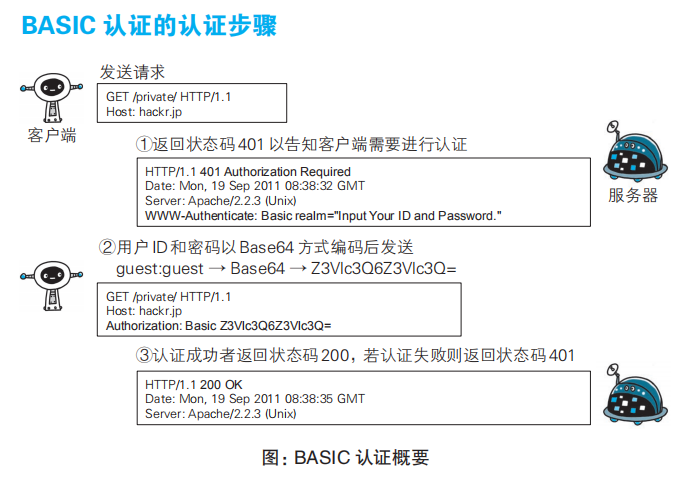
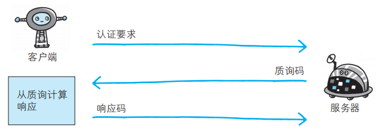
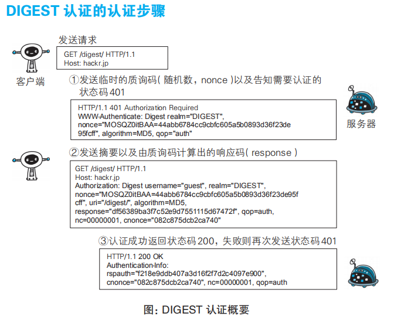
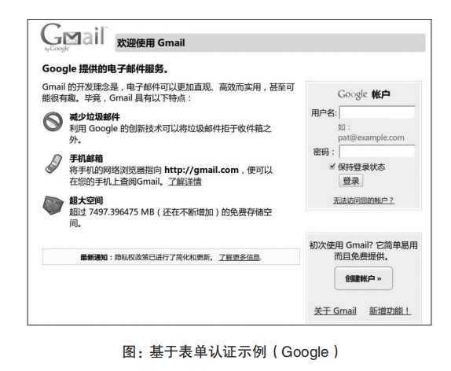
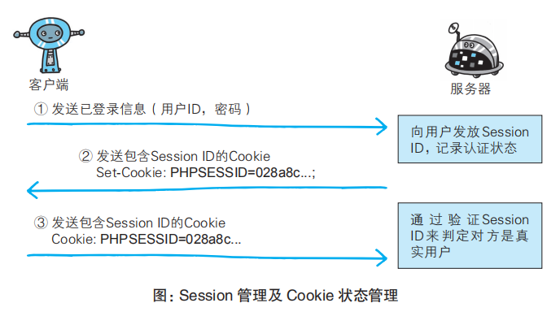

# 确认用户身份的认证
HTTP/1.1使用的认证方式有：
- BASIC认证
- DIGEST认证
- SSL客户端认证
- FormBase认证（基于表单的认证）

### BASIC认证
BASIC认证直接将用户名密码以Base64格式发送，可能会被人窃取到；并且想再次进行BASIC认证时，一般的浏览器无法实现认证注销操作。

步骤可以见下图： 

### DIGEST认证
为了弥补basic认证缺点，有了digest认证：一种质询/响应的方式，一方先发送认证要求给另一方，接着使用从另一方那接收到的质询码，生成响应码，最后将响应码返回给对方进行认证。

DIGEST 认证提供防止密码被窃听的保护机制，但并不存在防止用户伪装的保护机制。

流程如下图： 

### SSL客户端认证
SSL客户端认证可以避免账户名密码被盗而被第三者冒充。

SSL客户端认证是借助HTTPS客户端证书完成认证的方式。借客户端证书认证，服务器可确认访问是否来自已经登录的客户端。

### FormBase认证
由于使用上的便利性及安全性问题， BASIC认证和 DIGEST 认证几乎不怎么使用。另外，SSL 客户端认证虽然具有高度的安全等级，但因为导入及维持费用等问题，尚未普及。

基于表单的认证：客户端会向服务器上的 Web 应用程序发送登录信息（Credential），按登录信息的验证结果认证。

比如： 

但鉴于HTTP是无状态协议，如果要实现状态管理，要借助cookie和session： 
