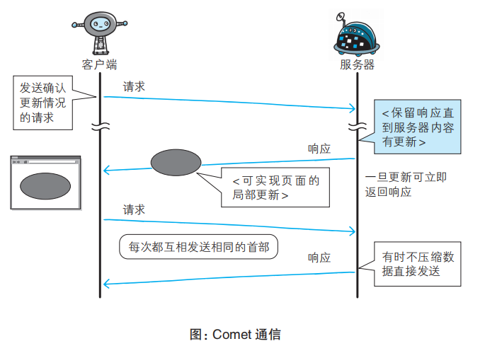

# 基于HTTP的功能追加协议
在建立HTTP标准时是想把它当作传输HTML的文档协议。随着web发展，web用途更多样化，http在性能上未必是最优的。

由于HTTP协议使用广泛，用全新的协议来完全代替不现实，于是发展了一些基于HTTP且添加了新功能的协议。

### SPDY（消除HTTP性能瓶颈）
Google在2010发布了SPDY（发音speedy），旨在解决HTTP的性能瓶颈，缩短web页面的加载时间。

##### 为什么说HTTP有性能瓶颈呢？

对于需要大量内容更新的网站，为了确认是否有内容更新，就要频繁地发送请求到服务端，而一些HTTP标准就会成为瓶颈：

- 请求只能从客户端开始，客户端不能接除响应外的其他指令
- 请求/响应头部未经压缩就发送。首部信息越多延迟越大
- 发送冗长的首部。每次互相发送相同首部造成浪费
- 非强制压缩发送，可任意选择数据压缩格式

不管有没有更新，响应都会把数据全部再发送一次，造成了浪费

##### Ajax的解决方法
Ajax（异步js与XML技术）是一种有效利用js和DOM的操作，达到局部更新的异步通信手段。

通信流程如下图： 

虽然响应中传输数据少了，但是没根本上解决HTTP协议存在的问题，依然有频繁发送请求、相同首部等问题。

##### Comet的解决方法
基于HTTP长连接的“服务器推送”技术。一旦服务器有内容更新，comet会直接给客户端返回响应。

为了实现推送功能，服务器收到请求后会将响应挂起，当服务端有内容更新时，再返回响应。

但是为了保留响应，一次连接的持续时间变长，为了维持连接会消耗更多资源。此外仍未解决HTTP本身存在的问题。

下面是《js高级程序设计》对commet的介绍： 
comet是一种高级的Ajax技术，实现comet的 两种 方式：长轮询和http流。 
  1)轮询

  短轮询：浏览器定时向服务器发起请求，看有没有更新的数据

  长轮询：浏览器发起一个请求，服务器收到后没有立即响应，而是保持链接到有数据可发送。浏览器收到响应后又立即发送请求。

  轮询的优势是所有浏览器都支持，使用XHR对象和setTimeout就能实现

  2)HTTP流

  在页面的整个周期内只使用一个HTTP连接：浏览器发起一个请求，而服务器保持连接打开，然后周期性向浏览器发送数据。通过侦听readystatechange事件以及检测responseText值是否为3，就可以利用XHR对象实现HTTP流。

commet通信流程如下图： 

##### SPDY的解决方法
SPDY的出现是为了在协议级别消除HTTP的瓶颈，没有改写HTTP协议，而是在TCP/IP的应用层与传输层之间，加入一个会话层（控制对数据的流动）的形式运作。同时为了安全性，SPDY规定通信过程中使用SSL。

SPDY的设计： 

使用SPDY后，HTTP协议多了以下功能：

1. 多路复用流
  ps: 多路复用和长连接的区别？

  长连接是只要任意一端没有明确提出断开连接，则保持TCP连接状态；管线化是在持久连接的基础上，使得不用等待响应就可以发送下一个请求。但是，若干个请求排队串行化单线程处理，后面的请求等待前面请求的返回才能获得执行机会，一旦有某请求超时等，后续请求只能被阻塞，也就是人们常说的线头阻塞。

  多路复用是多个请求可同时在一个连接上并行执行。某个请求任务耗时严重，不会影响到其它连接的正常执行，处理效率也更高。

2. 赋予请求优先级
  SPDY不仅可以并发处理请求，还可以格请求逐个分配优先级顺序。主要是为了在发送多个请求时，解决因带宽低而导致响应变慢的问题。

3. 压缩HTTP首部
  减少通信产生的数据包数量和发送的字节数

4. 推送功能
  服务器可以预期到请求网页后，可能还会请求相关静态资源，会主动把这些静态资源推送给客户端。当客户端需要这些资源时，可以直从缓存取得，不用再发请求。

5. 服务器提示功能
  可以主动提示客户端请求所需的资源。由于在客户端发现资源之前就可以获知资源的存在，因此在资源已缓存等情况下，可以避免发送不必要的请求

注意： 
SPDY是将单个域名（IP地址）的通信多路复用，所以当一个web网站上使用多个域名下的资源时，改善效果受到限制；

SPDY确实是一种可以消除HTTP瓶颈的技术，但是很多网站存在的问题不仅仅是由HTTP瓶颈引起的。对Web本身速度的提示，还可以从其他方面入手，比如改善web内容的编写方式等

### WebSocket（使用浏览器进行全双工通信）
##### WebSocket是什么
WebSocket 协议由 IETF （负责互联网技术标准的互联网工程任务组）定为标准，WebSocket API 由 W3C 定为标准。仍在开发中的 WebSocket 技术主要是为了解决 Ajax 和 Comet 里XMLHttpRequest 附带的缺陷所引起的问题。

WebSocket即Web 浏览器与 Web 服务器之间全双工通信的标准（全双工通信：通信双方可以同时发送和接收信息的信息交互方式），通信过程中可互相发送JSON、XML、HTML 或图片等任意格式的数据。

但是由于建立在HTTP标准基础上，连接的发起端仍然是客户端。WebSocket通信连接后，双方可以互发报文。

在js中创建WebSocket后，会有一个HTTP协议请求发送到服务器以发起连接。取得响应后，建立起的连接会使用HTTP升级从HTTP协议交换为WebSocket协议。（js高级程序设计）

##### WebSocke特点
1）推送功能

支持由服务器向客户端推送数据功能

2）减少通信量

只要建立起WebSocket连接，可以保持着连接状态。和HTTP相比，不仅每次连接的总开销减少，而且由于WebSocket首部信息很小，通信量也减少了

##### 实现WebSocket
需要完成一次“握手”步骤：

1.握手-请求：

在HTTP请求头部的Upgrade字段中，告知服务器通信协议发生改变 

2.握手-响应：

对于之前的请求，返回状态码101 Switching Protocols的响应 

Sec-WebSocket-Accept 的字段值是由握手请求中的 Sec-WebSocket-Key 的字段值生成的。

成功握手后，通信时不再使用HTTP数据帧，而采用WebSocket独立的数据帧。 

##### WebSocke的API
js可以调用WebSocket API以实现WebSocket协议下全双工通信。

比如： 

### SPDY与WebSocket的关系
SPDY和WebSocket都解决了某些相同的问题，比如服务器推送。但是它们的侧重点不一样，SPDY侧重给web页面提高加载速度，websocket侧重于为web提供一种双向通讯机制及API。

### HTTP/2
HTTP/2（不叫HTTP/2.0，因为不打算发布子版本了，下一版本是HTTP/3）目的也是为了提升web页面加载速度，可以看作SPDY的升级版。

它的特点：
- 新的二进制格式 
  HTTP/1.1的头部信息是文本（ASCII编码），数据体可以是文本也可以是二进制。而HTTP/2则头部信息、数据体都使用了二进制。

  使用二进制的好处：基于文本协议的格式解析存在缺陷，文本的表现形式多样性所有要考虑很多。而二进制格式只有0和1
- 多路复用
- 优先级
- 压缩报文首部
- 服务器推送

与SPDY的区别？ 
HTTP/2支持实现明文运输，而SPDY强制使用HTTPS；
首部信息的压缩算法不同。